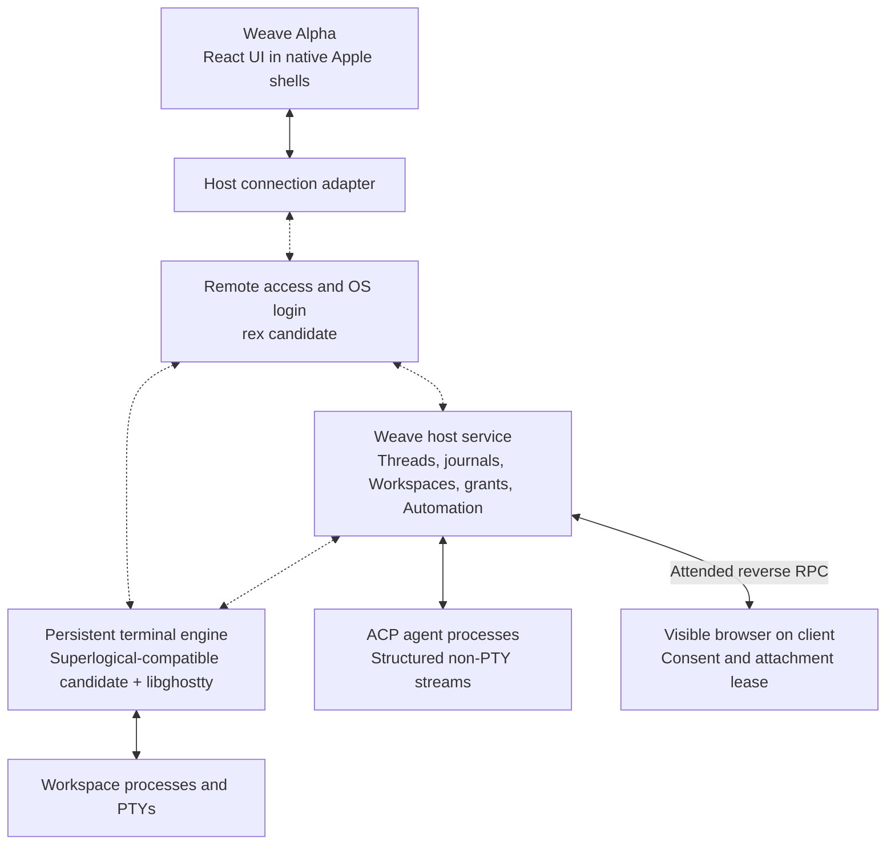

# Superlogical, rex, and a possible post-Portal Weave

_Exploratory research snapshot: 2026-09-09. Primary sources checked live, including the September 8 remote-session demo. This is research, not an implementation specification or a decision to replace Portal._

## What changed most recently

Mitchell Hashimoto published **Superlogical Remote Sessions Pre-Alpha Demo** on **September 8, 2026 at 20:45 UTC**. His accompanying Mastodon post followed at 20:52 UTC. It introduces **rex by name as an SSH replacement** inside the demonstrated Superlogical remote-access stack. This is considerably newer and more concrete than the July company announcement or the August local-session previews. ([Founder demo](https://www.youtube.com/watch?v=PdwTjSBW6Y8), [original announcement](https://hachyderm.io/@mitchellh/117237397684548220))

The demo establishes an important boundary: rex does more than keep a socket or PTY alive. It authenticates a remote identity, maps that identity to an operating-system user, and creates a system login. However, **the full protocol and transport have deliberately not been disclosed**. In the video Hashimoto explicitly defers those details at 3:38–3:51. Calling rex QUIC-based, Iroh-based, or a published embeddable library would therefore exceed the evidence. ([Demo: login](https://www.youtube.com/watch?v=PdwTjSBW6Y8&t=52s), [identity mapping](https://www.youtube.com/watch?v=PdwTjSBW6Y8&t=132s), [transport disclosure boundary](https://www.youtube.com/watch?v=PdwTjSBW6Y8&t=218s))

## Evidence and maturity

| Item | What is verified on September 9 | Maturity and limits |
| --- | --- | --- |
| Superlogical product direction | Durable sessions spanning human, automated, and production work; terminal multiplexer first; composability and production operation later. | Published company direction. The later phases are a roadmap. ([Homepage](https://www.superlogical.com/)) |
| Remote persistent sessions | Remote VPS reached through a tailnet; multiple terminal splits over the same connection; local app exit/reopen reconnects to sessions. | Founder pre-alpha demonstration, not independently reproduced acceptance. ([September 8 demo](https://www.youtube.com/watch?v=PdwTjSBW6Y8&t=25s)) |
| rex login | Full system login, login-shell setup, per-user limits and login accounting; identity-to-OS-user mapping; existing SSH keys respected; ordinary-user and root access demonstrated. | Founder demonstration and explanation. Authentication configuration, policy schema, revocation, delegation, and privileged implementation are unpublished. ([Demo](https://www.youtube.com/watch?v=PdwTjSBW6Y8&t=52s)) |
| CLI and directory operations | CLI reports caller/route/acting identity, creates and kills sessions; local and remote directory chooser opens a terminal in the selected directory. | Demonstrated product features; no public API schema or third-party SDK verified. ([CLI](https://www.youtube.com/watch?v=PdwTjSBW6Y8&t=112s), [directory chooser](https://www.youtube.com/watch?v=PdwTjSBW6Y8&t=289s)) |
| Deployment | Founder says Mac app itself is a server, self-run CLI works on Linux, NixOS module exists, and no hosted service is required or being launched. | First-party development disclosure; public runnable packaging not verified. ([August 28 deployment reply](https://hachyderm.io/@mitchellh/117175457057731197)) |
| Networking | Built-in Tailscale/Headscale node support disclosed; tailnet connection and Tailscale-derived identity shown. | Does not identify the complete rex transport. The August reply describes something like tailcat for direct connections as future intent. ([Networking reply](https://hachyderm.io/@mitchellh/117175411327821846), [September demo](https://www.youtube.com/watch?v=PdwTjSBW6Y8&t=132s)) |
| Public Superlogical/rex access | Homepage still invites signup for first release/beta and future OSS drops; official GitHub organization lists no public repositories. | No public installer, runnable server source, rex SDK, complete protocol specification, open web demo, or public TestFlight was verified. This is a bounded search result, not proof that no private access exists. ([Access page](https://www.superlogical.com/), [official organization](https://github.com/superlogical)) |
| libghostty | Public C terminal emulator API and source, including binary snapshot encode and incremental restore. | Source-verifiable building block. API unstable; snapshot format v1 explicitly lacks a binary-compatibility guarantee. ([Tip API docs](https://libghostty.tip.ghostty.org/), [pinned snapshot header](https://github.com/ghostty-org/ghostty/blob/448062571c5edf010b7490d06869b88b5ebf8f80/include/ghostty/vt/snapshot.h)) |

Superlogical builds on the same MIT-licensed libghostty components available to others; this does **not** establish the license or reuse rights for the Superlogical application, rex, session manager, or network protocol. Hashimoto says shared terminal work will continue upstream. Ghostty remains separate under its nonprofit. ([July 29 founder announcement](https://mitchellh.com/writing/superlogical))

## The terminal architecture: binary bootstrap, then live PTY bytes

The founder's high-level architecture video is publicly available on YouTube with a September 2 publication timestamp. Its description is more precise than “binary screen-state streaming.” ([Architecture video](https://www.youtube.com/watch?v=Y6nFMmUPzXM))

1. **The host owns the PTY and authoritative terminal state.** When a new client attaches, processing pauses briefly to take a consistent state transfer. The client receives a binary terminal snapshot with enough screen, dimension, cursor, and parser state to render immediately. A READY marker separates that prefix from older history. ([1:58–3:23](https://www.youtube.com/watch?v=Y6nFMmUPzXM&t=118s))
2. **Live updates are raw PTY bytes.** The server tees the byte stream to the clients, which each run a compatible terminal state machine. This is not continuous screen-diff transmission. User input goes back through the authoritative server for serialization. ([3:23–4:56](https://www.youtube.com/watch?v=Y6nFMmUPzXM&t=203s))
3. **Scrollback catches up separately.** Older history streams newest-first while live interaction continues. Each client owns its selection and viewport. A client that diverges can repeat the snapshot process. ([4:57–6:07](https://www.youtube.com/watch?v=Y6nFMmUPzXM&t=297s))
4. **Each terminal view corresponds to its own PTY.** Native windows, splits, and tabs compose those terminals. The founder also discusses a legacy single-terminal compatibility mode for clients that do not understand the binary protocol. That future compatibility path gives up some architectural benefit; it is not evidence of an already available Weave adapter. ([7:07–9:02](https://www.youtube.com/watch?v=Y6nFMmUPzXM&t=427s))

The August 28 original post independently describes the server maintaining replicated distributed terminal state machines, and a reply says everything in that demo, including input, is API-driven. “API-driven” proves that the product has programmatic control internally; it does not promise an available supported public SDK. ([Original demo post](https://hachyderm.io/@mitchellh/117175283681274864), [API reply](https://hachyderm.io/@mitchellh/117175529089990313))

### What is already in public libghostty source

At the inspected Ghostty main commit **`448062571c5edf010b7490d06869b88b5ebf8f80`**, the C header exposes `ghostty_snapshot_encode`, `ghostty_snapshot_decoder_ready`, `ghostty_snapshot_decoder_next`, and complete decode operations. The format is an ordered CRC32C-protected record stream with a `GHOSTSNP` envelope, unfinished VT/UTF-8 continuation, READY, newer-to-older history pages, and FINISH. The decoded terminal may render, resize, and accept live PTY bytes between history pages. ([Pinned C header](https://github.com/ghostty-org/ghostty/blob/448062571c5edf010b7490d06869b88b5ebf8f80/include/ghostty/vt/snapshot.h))

These APIs make the terminal-state primitive concrete today. They do not create a persistent process, authenticate a remote peer, decide who may type, provide session discovery, or make the destination durable. The header explicitly says encoding does not flush or make the destination durable, and calls version 1 a work in progress without a binary-compatibility guarantee. Treat this as a usable experimental component whose version must be pinned and negotiated, not a stable distributed-session standard. ([Pinned C header](https://github.com/ghostty-org/ghostty/blob/448062571c5edf010b7490d06869b88b5ebf8f80/include/ghostty/vt/snapshot.h))

The public C library handles terminal parsing, state, scrollback, reflow, input encoding, incremental render-state updates for custom renderers, and WebAssembly utilities. **Inference:** that supports native and browser terminal experiments, but a matching renderer and shell integration still have to be built or selected; libghostty-vt alone is not a complete embeddable application UI. The documentation warns that the API is not stable. ([Current library docs](https://libghostty.tip.ghostty.org/))

## What rex adds to the picture

At 0:52–1:31 in the September 8 demo, the remote terminal is shown as a real system login rather than merely a child shell launched by an application service. At 2:12–2:53 the CLI distinguishes the Tailscale caller identity and route from the operating-system identity being assumed; a server-side mapping determines allowable impersonation. That distinction is directly relevant to Weave: a connection's authenticated peer is not automatically the account whose files or processes it may operate. ([System login](https://www.youtube.com/watch?v=PdwTjSBW6Y8&t=52s), [Caller and acting identity](https://www.youtube.com/watch?v=PdwTjSBW6Y8&t=132s))

The same demo shows session creation, destruction, and remote directory operations above the login layer. **Inference:** a future reusable rex layer could take responsibility for transport, authentication, account entry, and remote execution while a higher session layer owns the workspace lifecycle. The demonstration does not yet show that these are independently distributable modules or that arbitrary third parties can register services on rex. ([CLI operations](https://www.youtube.com/watch?v=PdwTjSBW6Y8&t=177s), [Directory operations and deferred architecture](https://www.youtube.com/watch?v=PdwTjSBW6Y8&t=289s))

The full SSH-replacement claim is the founder's characterization. The demonstrated subset does not independently establish compatibility with SFTP, SCP, SSH port forwarding, agent forwarding, PAM policy, certificates, arbitrary SSH clients, or every SSH use case. Likewise, the Mosh comparison establishes architectural inspiration, not a guarantee of predictive input, connection migration, packet-loss behavior, or any particular UDP/QUIC transport. ([Demo qualification](https://www.youtube.com/watch?v=PdwTjSBW6Y8&t=218s))

## Questions that remain open for Weave

- Is the desired move **to reuse Superlogical/rex when they expose supported interfaces**, or to **build a Weave host runtime using public primitives inspired by them**? Those lead to different ownership and timing.
- Should Alpha consume separate general-purpose host services directly, or continue to reach them through one Weave host service? The current product already connects directly to independent Hosts; removing a central server is not a change it needs.
- Does “persistent” mean surviving application disconnection, host-runtime restart, execution-host reboot, or moving active work to a different machine? Terminal snapshots establish neither arbitrary process checkpointing nor filesystem replication.
- Does the desired ownership unit remain an agent thread, or become a durable workspace/session containing terminals, files, agents, previews, and tools to which threads attach?
- Which current non-terminal Portal duties must remain available, especially structured agent execution, workspace-scoped file access, device grants, durable Thread history, Zed ACP interoperability, and attended browser control? Which additional capabilities, such as previews or language services, are future ambitions? A terminal/login primitive does not imply either set.

## Mapping onto the current Weave product

Repository baseline inspected: `8fabcb865b2b7809aa90b79ed2c67b39f23ae472`, plus the existing working tree. The active architecture is `product/alpha`, `product/portal`, and `product/protocol`; the older top-level applications are not the basis of this exploration. Existing unrelated working-tree changes were left untouched. This section contains architectural hypotheses, not accepted changes to the domain model or implementation requirements.

Alpha already attaches directly to several Hosts, retains Host-scoped identities, and groups physical Workspaces into logical Projects using normalized Git remotes. Portal runs beside the files and agent credentials. This is already compatible with the placement principle suggested by Superlogical: clients present work that lives elsewhere. ([Product architecture](../../product/README.md), [Portal responsibilities](../../product/portal/README.md))

| Existing responsibility | Possible future owner | What would actually change |
| --- | --- | --- |
| Network listener, TLS setup, connection authentication | A reusable rex service, if its interfaces become available | Potentially simplify connection establishment and integrate identity-to-OS-user admission; preserve explicit Weave authorization. |
| Persistent shells and terminal state | Superlogical-compatible session engine using libghostty | Replace the private tmux backend; implement coherent binary bootstrap, compatible live emulation, separate history, and resynchronization. |
| Threads, provider session mapping, event history, archive/restore, ACP recovery | A smaller Weave host service | Retain structured product authority and multi-client continuity. A login or terminal engine does not supply this. |
| Workspace catalog, canonical paths, conditional file writes, grants | Weave host service, unless an equivalent supported host API emerges | Preserve existing product semantics; a remote directory picker does not establish equivalent filesystem concurrency or confinement. |
| Human terminal input ownership | Weave policy enforced at the session engine boundary | Current one-controller/many-observers behavior needs enforcement even if clients connect directly to a shared engine. |
| Visible browser and consent | Alpha's native browser plus a Weave broker | Retain reverse calls from host to the client, bounded leases, cancellation, and disconnect behavior. |
| Automation execution | Weave's host-side Automation adapter | Session/process persistence can support execution but does not replace durable workflow state or effect reconciliation. |

### A plausible default: a smaller Weave service above shared host primitives

The drawing shows logical responsibilities, not a requirement for three daemons. The rex and session-engine interfaces are hypothetical integration points until published.

This would let Weave share execution infrastructure with a terminal application, editor, or CLI while retaining its own richer view of the work. A user could start an agent on Bazzite, close Alpha on the Mac, and later attach from the iPad to the same Thread and surrounding terminals. The host remains the owner. Changing client or network attachment would not create a new logical Thread or restart a shell. Much of that lifecycle is already a Weave goal and partially implemented; the new architecture offers shared infrastructure and potentially better terminal restoration rather than inventing persistence from scratch.

The smallest migration could keep the existing Weave protocol and substitute only a terminal backend or carry existing traffic through a remote-access tunnel, **if** supported. That would be an incremental integration. Real binary snapshot restoration requires a broader change: `TerminalBackend.capture` and `TerminalSnapshot.data` currently contain strings, and Alpha feeds them to xterm. Preserving that exact interface cannot expose native libghostty snapshot decoding or separately paged history. The public lifecycle concepts can survive while the terminal data path and renderer evolve. ([Backend interface](../../product/portal/src/terminals.ts), [Wire contract](../../product/protocol/src/terminals.ts), [Renderer](../../product/alpha/src/components/xterm-terminal-view.tsx))

For the native Apple clients, one plausible implementation places connection and terminal primitives in the Swift shell and exposes bounded events and commands to React. This is an option to investigate, not evidence of a rex Swift SDK. A pure browser client would need a separately verified compatible transport and terminal renderer. The existence of Superlogical's own web client does not establish an embeddable web SDK for Weave.

There is no demonstrated reason to rewrite all host logic into another language. A native connector or helper could serve the Deno host process over local IPC. The working tree's accepted Automation ADR specifically retains Deno with a private OpenWorkflow adapter, subject to its acceptance gate. Transport experimentation does not itself overturn that decision or establish that Automation has shipped. ([Automation ADR](../adr/0003-use-openworkflow-for-automation-execution.md))

### A more radical possibility: Weave as a client of a shared work runtime

If Superlogical eventually exposes a stable resource model, durable metadata, service registration, constrained authorization, and arbitrary non-PTY execution channels, the Weave service could become a hosted extension inside that runtime. Users might install only the generic host runtime, with Weave functionality loaded as a component. Alternatively, Alpha could bootstrap a versioned Weave helper on demand if remote execution supports it. Both would remove a separate Portal installation experience; neither automatically removes Weave-specific host behavior.

A possible new product concept would be a durable work session containing references to several Threads, terminals, files, and jobs within a Workspace. A Thread would remain the structured history of agent interaction; a terminal would remain a process-backed resource; a pane would be a disposable view. A multi-Host session could aggregate references while preserving each resource's owning Host. It would not move a running process or synchronize workspace files merely by sharing a session identifier. This is an optional domain extension to discuss, not a rename of an existing concept.

The distinguishing benefit would be shared work across applications. A shell opened through another compatible client could become visible in Weave, and structured Weave work could remain available after Alpha exits. That outcome requires shared lifecycle APIs and ownership rules. Sharing libghostty or using the same remote-login transport alone cannot produce it.

### The responsibilities that cannot disappear accidentally

**ACP needs a durable protocol owner.** Today Weave launches ACP agents with piped stdin/stdout, translates attachments into provider interactions, journals events, and handles provider generations. A terminal screen cannot substitute for structured tool calls, configuration, permissions, or provider session identity. Generic process supervision could preserve an agent process across a Weave service restart, but only if its non-PTY channel, buffering, attachment ownership, and recovery protocol support that behavior. Merely launching it remotely does not establish those guarantees. ([Agent process](../../product/portal/src/agent-process.ts), [Thread runtime](../../product/portal/src/thread-runtime.ts), [Journal](../../product/portal/src/thread-journal.ts))

**Connection recovery, process survival, history recovery, and workflow recovery are separate.** Neither a terminal snapshot nor an intact socket proves that an interrupted agent action completed. Current `PROMPT_UNCERTAIN` behavior handles a real ambiguity and should not become blind prompt replay after reconnection. Surviving client disconnection also says nothing by itself about surviving Host reboot or moving live work to another Host.

**Remote identity and product permission remain different.** Rex demonstrates identity-to-OS-account mapping. Weave currently also applies action, Workspace, and Agent grants. If a client can bypass those grants through unrestricted execution as the same OS user, they do not confine that client's overall host access. Direct terminal-engine access therefore needs authorization consistent with the intended product boundary, or an explicit decision to adopt OS-account-level authority. Existing device credentials should not silently become transport identities. ([Current security contract](../../product/portal/SECURITY.md))

**Client-owned capabilities have a different lifetime.** Alpha's visible browser is on the user's device. Disconnecting that device must invalidate its attachment and pending control, even while remote shells and agent processes continue. A new transport must support host-to-client calls and cancellation without silently re-establishing browser consent. ([Browser broker](../../product/portal/src/browser-control.ts))

## An independent route using available networking primitives

If inspiration matters more than direct Superlogical compatibility, Iroh is a separately available candidate for the connection layer. Its official June 15, 2026 version 1.0 announcement documents key-addressed encrypted QUIC connections, multipath, NAT traversal, relay support, and wire-version guarantees; official bindings include Swift and Node.js. This is evidence about **Iroh**, not evidence that rex uses it. ([Iroh 1.0](https://www.iroh.computer/blog/v1), [language bindings](https://www.iroh.computer/blog/iroh-language-support))

Weave could explore Iroh plus libghostty plus its existing domain services today, but would own remote execution policy, resource discovery, terminal supervision, and protocol integration itself. Native Swift integration is a plausible starting point; Deno compatibility, browser transport behavior, relay operation, and packaging need direct validation. Such a system would be inspired by Superlogical, with no claim of rex or Superlogical wire compatibility. Using one bidirectional stream per interactive resource could separate backpressure and cancellation, while still requiring explicit application framing, bounded buffers, and scheduling. ([Iroh QUIC patterns](https://docs.iroh.computer/protocols/using-quic))

## Provisional assessment

The strongest exploratory direction is to separate Weave's durable product services from generic remote access and terminal infrastructure. The existing code already contains some useful boundaries, especially `TerminalBackend`, but obtaining the full benefit requires revisiting the client data path as well. Literal adoption of rex or Superlogical remains dependent on unpublished interfaces and reuse terms. An independent build from public components is technically more concrete, but retains substantially more infrastructure ownership in Weave.

Before an implementation decision, the most useful evidence would be one complete Mac-to-iPad handoff involving a running agent and terminal, a connection interruption, correct history restoration, and preserved input/permission ownership. A second, separate failure scenario should establish what happens when the Weave service or owning Host stops. Those are future experiment criteria, not tests performed in this research.

## Research method and boundaries

Read the live official homepage, founder announcement, official GitHub organization and API, founder Mastodon API, first-party YouTube transcripts, and pinned libghostty source. Mastodon API supplied exact timestamps and unabridged founder posts when web extraction of the HTML pages failed. YouTube page metadata supplied publication timestamps; its native transcript exporter supplied auto-generated captions. Captions misrecognize product names in places, so no exact command spelling was inferred from them. No software was installed, no remote login was attempted, and no private beta was accessed. Performance and product behavior shown in videos remain founder evidence, not measurements reproduced here.
