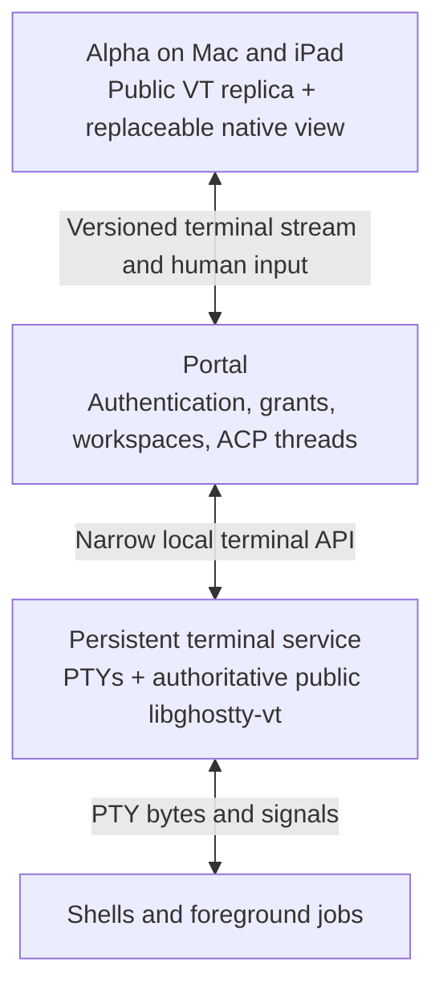

# WVE-75: align terminal infrastructure with Ghostty and Superlogical

Research date: 2026-09-11. This is an architectural recommendation, not an accepted implementation specification. It refreshes the September 9 Superlogical exploration against the current Weave working tree and public sources. No application, tracker, installed runtime, or user session was changed.

## Recommendation

Build against Ghostty's public libraries and make the terminal execution service replaceable. A small persistent PTY service using server-side libghostty-vt is a credible successor to tmux for Weave. Investigate it with one bounded end-to-end implementation before committing to removal. Keep the current tmux backend until the replacement proves equivalent lifecycle behavior.

The prospective benefit is substantial: replace tmux's separate emulation and captured-text reconstruction with the same upstream terminal core on the Host and clients, and use upstream binary snapshots. The cost shifts to process supervision, ordered replication, reconnects and upgrades. Opening a PTY is straightforward; making a durable terminal service reliable is a real, but narrower, engineering task. We already own layout, workspace membership, authorization and much attachment orchestration, so a replacement does not require recreating tmux's entire user-facing multiplexer.

Favor public libghostty APIs over adopting a full Ghostty fork solely to follow cmux. Future Superlogical integration might be an external service rather than an in-process library. A narrow execution/stream boundary supports either without predicting its protocol.

## What is announced, demonstrated, available, and inferred

| Evidence | What it establishes | What remains unknown |
| --- | --- | --- |
| Superlogical's July 29 announcement and current homepage | A terminal multiplexer first, then composability, then production operation; durable work sessions exposed to humans and software. | No public session SDK, plugin ABI, independently reusable daemon, or stable network contract is promised by those specifics. |
| Founder's July 29 and August 30 statements | The same public MIT libghostty components underpin Superlogical; terminal-specific work, explicitly including binary snapshots, is contributed upstream. | This does not establish the license or reuse terms of rex or the Superlogical application. |
| August 28 demo announcement | A custom binary protocol and replicated terminal state machines; API-driven interaction. | Internal APIs do not establish a supported third-party protocol. |
| September 2 architecture and memory demonstrations | Terminal-state replication, binary bootstrap and deliberate server I/O/memory engineering. | Founder performance demonstrations have not been independently benchmarked here. |
| September 8 rex remote demo | Persistent remote work and a remote-login layer, with identity-to-OS-user mapping described in prior transcript evidence. | No complete published rex transport, authentication policy schema or embedding contract was verified. |
| Current public Ghostty source | Headless VT, state snapshots, effects, input encoding and render-state extraction are usable building blocks. | The public API and snapshot format remain unstable; these components do not supply a persistent session daemon. |

Primary sources: [Superlogical homepage](https://www.superlogical.com/), [founder announcement](https://mitchellh.com/writing/superlogical), [specific upstream snapshot statement](https://hachyderm.io/@mitchellh/117186436169699826), [replicated-state announcement](https://hachyderm.io/@mitchellh/117175283681274864), [API-driven operation](https://hachyderm.io/@mitchellh/117175529089990313), [memory architecture announcement](https://hachyderm.io/@mitchellh/117203605799705501), [remote demo](https://www.youtube.com/watch?v=PdwTjSBW6Y8).

The most concrete modularity commitment belongs to **libghostty**. Its published roadmap describes a family of libraries, eventually including GPU rendering, GTK widgets and Swift terminal-view frameworks. The 2025 article's old C-API availability statements are superseded by current source; its future renderer/framework direction remains a roadmap, with no delivery date inferred here. [Libghostty roadmap](https://mitchellh.com/writing/libghostty-is-coming).

The official site still invites beta/first-release signup and future OSS announcements. No public repository was listed in the official organization when checked. Aligning with the architecture is feasible; claiming interoperability with Superlogical is not. [Official organization](https://github.com/superlogical).

## Public source already supports the relevant architecture

Inspected Weave pin: `4a70ee4718ba0967bcfd72f43adb715bf65a860d`. Refreshed upstream HEAD: `44f2a44df7e8c4a0c6df3f7d872ef3d7ead88e51`, September 10. Their public snapshot headers are identical.

### Binary state instead of reconstructed ANSI

The public C snapshot API already in our pin has a READY boundary after the active screen and unfinished parser input. Older history follows, newest first, so a client can become interactive before all scrollback arrives. This is a binary state codec, not a screenshot or a screen repaint expressed as ANSI. [Snapshot C API](https://github.com/ghostty-org/ghostty/blob/4a70ee4718ba0967bcfd72f43adb715bf65a860d/include/ghostty/vt/snapshot.h).

The encoded state covers modes, palette overrides, tab stops, scroll regions, title/directory, saved cursors, styles, hyperlinks and per-screen Kitty keyboard state. That directly addresses fields our tmux capture reconstruction either restores manually or omits. [Terminal record](https://github.com/ghostty-org/ghostty/blob/44f2a44df7e8c4a0c6df3f7d872ef3d7ead88e51/src/terminal/snapshot/terminal.zig), [screen record](https://github.com/ghostty-org/ghostty/blob/44f2a44df7e8c4a0c6df3f7d872ef3d7ead88e51/src/terminal/snapshot/screen.zig), [Weave reconstruction](../../product/portal/src/terminal-snapshot.ts).

There are two material limits. Format v1 is explicitly work in progress without binary compatibility guarantees, and the format is explicitly not a complete multiplexer transport. A compatible version number alone is insufficient for rolling upgrades; Weave would initially need an exact codec build identity or a tested compatibility range. Selection and viewport are intentionally local. Kitty image and placement registries are also omitted, so image restoration must not be promised without additional work. [Format contract](https://github.com/ghostty-org/ghostty/blob/44f2a44df7e8c4a0c6df3f7d872ef3d7ead88e51/src/terminal/snapshot/main.zig), [graphics omission test](https://github.com/ghostty-org/ghostty/blob/44f2a44df7e8c4a0c6df3f7d872ef3d7ead88e51/src/terminal/snapshot/snapshot.zig#L1199-L1274).

### A headless authoritative emulator

Public libghostty-vt allows a Host parser to receive PTY bytes and emit replies through its effects callback. Display replicas can omit that reply callback while continuing to encode human keyboard/mouse/paste input. That supplies a clean mechanism for fixing the duplicate-reply defect. Clipboard and notification effects need their own deliberate routing; dropping machine replies must not make the human input surface read-only. [Public terminal/effects API](https://github.com/ghostty-org/ghostty/blob/44f2a44df7e8c4a0c6df3f7d872ef3d7ead88e51/include/ghostty/vt/terminal.h).

One authoritative responder is our correctness recommendation and a natural fit for replicated state. The available Superlogical evidence does not independently establish its exact automatic-reply implementation, so this is not attributed to an unpublished implementation.

### Rendering remains a separate adoption track

The current full `include/ghostty.h` explicitly identifies itself as internal and tailored to Ghostty's macOS app, directing third-party consumers to public libraries. The full build rejects iOS except for VT output. Retained Metal/UIKit source branches do not establish a supported public iPad renderer. [Internal embedding boundary](https://github.com/ghostty-org/ghostty/blob/44f2a44df7e8c4a0c6df3f7d872ef3d7ead88e51/include/ghostty.h#L1-L11), [iOS build restriction](https://github.com/ghostty-org/ghostty/blob/44f2a44df7e8c4a0c6df3f7d872ef3d7ead88e51/src/build/Config.zig#L132-L142).

Weave's current public-VT integration therefore already follows the upstream boundary. Keep its CoreText/native adapter isolated and reuse public selection, input and render-state facilities where applicable. A future public renderer or Swift view can replace that adapter independently of the session backend. Removing our painter through a private full-surface fork today trades one maintenance obligation for another.

## Proposed responsibility boundaries

This is a candidate architecture, not a claim about Superlogical's internal process layout:

Portal remains the network and product authorization boundary. The terminal service initially needs only local IPC, stable terminal IDs, creation/listing, attachment, input, resize, snapshot/history/live output, exit and close. It need not grow separate remote authentication, collaboration accounts, workspace layout or an ACP framework. Its process lifetime must be independent of Portal's normal restart/update lifecycle.

A future reusable session library can replace the service implementation. A future independently running Superlogical service can replace its adapter. A future rex transport can be assessed at the connection boundary. None requires changing Weave's workspace or thread identities in advance.

The existing [TerminalBackend interface](../../product/portal/src/terminals.ts) is a useful starting point, but its string-only captures are not sufficient. [TerminalSnapshot and events](../../product/protocol/src/terminals.ts), [Alpha's output queue](../../product/alpha/src/terminal/output-stream.ts), and [the native bridge](../../product/alpha/src/terminal/native-terminal.ts) all currently treat bootstrap as VT text. They need distinct binary snapshot and live-byte operations, codec identity, a consistent sequence boundary, generation reset and progressive-history handling. Base64 can carry opaque binary through existing JSON bridges initially; it must not pass through UTF-8 decoding as terminal text.

This is an evolution of the terminal data path across the stack, not only an implementation of `TerminalBackend.capture`.

## Is tmux still necessary?

**No, it is not architecturally necessary.** The terminal emulator and snapshot machinery are now public. A maintained PTY primitive can supply process I/O, and Weave already supplies the product UI. But tmux currently provides an independently running PTY owner and mature behavior that a replacement must preserve.

| Option | Work Weave retains | Assessment |
| --- | --- | --- |
| Keep tmux, correct response ownership and TERM | Control parsing, capture reconstruction, capability adaptation, native view | Lowest immediate effort; useful baseline and transition path. It retains the main emulation/restoration mismatch. |
| Dedicated PTY service + public libghostty-vt | PTY lifecycle, local service API, replication, versions, native view | Best alignment with the announced direction; credible reduction in terminal-specific custom logic after the initial implementation. Requires fault/upgrade validation. |
| Full Ghostty fork/internal surfaces | Fork/private API and Apple embedding integration, plus durable sessions | Can reduce custom rendering, but adds upstream divergence and does not itself solve persistent session ownership. |
| Wait for a public Superlogical component | Existing integration until availability and terms are known | Avoids speculative infrastructure, but has no verified delivery or compatibility contract to plan against. |

The important lifecycle distinction is between **Portal** and **the PTY owner**. An independent service can preserve terminals across Portal restarts. If that service itself dies, a saved screen does not recreate the shell's memory, file descriptors or running jobs. Neither the proposed service nor the current tmux backend should claim arbitrary host-reboot or PTY-owner-crash recovery.

Current Portal shutdown disconnects from tmux; it does not terminate its terminals. The packaged acceptance harness explicitly checks reattachment after a Host restart. A direct `Bun.spawn(..., { terminal })` inside Portal would therefore regress the current lifecycle unless PTY ownership is moved out of that restart boundary. [Portal terminal shutdown](../../product/portal/src/terminals.ts), [tmux disposal](../../product/portal/src/tmux-terminal-backend.ts), [packaged acceptance](../../product/portal/scripts/packaged-acceptance.ts).

### How much low-level work is actually required?

Bun 1.3.14 is already installed and exposes `Bun.Terminal`; verified locally without spawning a user process. Bun provides PTY creation, byte I/O and resizing for our macOS/Linux Host targets. That avoids writing `openpty` bindings ourselves, but does not supply a Ghostty binding, a durable service or live-upgrade protocol. [Bun terminal API](https://bun.com/reference/bun/Terminal), [spawn terminal option](https://bun.sh/reference/bun/Spawn/SpawnOptions/terminal).

Mitchell also publishes Go bindings that wrap public snapshots, effects and input encoders. The inspected September 8 revision is `9f448dfe80523fd2626414bad29f0295cfa47d48`. It uses cgo and static linking by default, requires a compatible separately built VT library and explicitly has an unstable API. It does not own PTYs. It is worth comparing a small Go terminal helper with a Bun/native-library bridge; adding a language solely because a binding exists is not automatically less maintenance. Portal does not need a language rewrite. [Binding source](https://tangled.org/mitchellh.com/go-libghostty/tree/9f448dfe80523fd2626414bad29f0295cfa47d48), [snapshot wrapper](https://tangled.org/mitchellh.com/go-libghostty/blob/9f448dfe80523fd2626414bad29f0295cfa47d48/snapshot.go).

The replacement should delegate terminal parsing, snapshot encoding, keyboard protocols and PTY mechanics to maintained libraries. Weave would still own bounded output buffering, atomic snapshot/live handoff, exactly one response writer, geometry ordering, terminal registry, process cleanup, local IPC authorization and packaging. No source review alone establishes that this is production-ready or cheaper over time.

## A bounded path to decide

1. Correct the current duplicate-reply and terminal-identity defects in WVE-75. This gives a reliable comparison baseline and applies regardless of the eventual backend.
2. Build one separate, non-default terminal service using the public VT API and a maintained PTY primitive. Exercise one real shell/TUI across Mac and iPad with binary bootstrap and live bytes; reuse existing Portal authorization and native drawing.
3. Pass explicit lifecycle and replication gates before replacing tmux. Keep implementation language and transport optimization subordinate to those results.
4. If the service passes and its owned code is smaller/clearer than the adapter logic it removes, adopt it for new terminals. Preserve already-running tmux terminals until they exit normally; do not imply that decoding their screen transfers their live processes to a new owner.
5. Remove the old backend when no live sessions require it. Track public Ghostty renderer and Superlogical integration releases independently.

Required evidence for step 3:

- One and two clients receive correct terminal state with exactly one reply per query; generated replies never claim size ownership.
- Closing/reopening Alpha, network loss, sleeping iPad, and normal or abrupt Portal restarts preserve the same shell/job processes.
- Attach during output, partial UTF-8/VT sequences, alternate screens, input modes, live input during history catch-up, and resync all converge without duplicate output.
- A slow client cannot block the shell indefinitely or grow memory without bound; a disconnected client can obtain a new consistent snapshot.
- Input-driven resize is ordered with PTY size and replica state; passive views preserve the established clipping behavior.
- Process exit removes its pane; graceful workspace close stops terminals and archives agent conversations. A temporarily unavailable registry is not treated as an empty registry that deletes workspaces.
- macOS and Linux packages correctly create login shells, handle foreground process groups/signals and clean up exited resources. Local socket ownership and Portal grants remain enforced.
- Mixed codec builds fail or negotiate predictably. Ordinary Portal upgrades preserve PTYs; terminal-service upgrades have an explicit policy for existing terminals. No promise of FD handoff or process checkpointing is required for the first version.

This proposed experiment is the point at which “easy enough to maintain robustly” becomes measurable. Its success would justify tmux removal; the present research makes that experiment worthwhile, not already passed.

## Research freshness and limits

Refreshed the official site, founder announcement, relevant Mastodon posts and latest 40 statuses, public organization, current Ghostty source, Go binding source and Bun documentation. Press coverage was used as a discovery aid; it supplied no stronger modularity/API promise than the primary sources. No newer product announcement than the September 8 remote demo was found in this bounded search.

YouTube metadata freshly confirms the September 2 [architecture](https://www.youtube.com/watch?v=Y6nFMmUPzXM) and [memory](https://www.youtube.com/watch?v=T5gV6anSt-4) videos and September 8 [remote demo](https://www.youtube.com/watch?v=PdwTjSBW6Y8). Caption retrieval was unsuccessful this time. Detailed architecture timestamps below come from the prior successful transcript review recorded in [the September 9 note](superlogical-rex-portal-exploration-2026-09-09.md), not a new viewing: bootstrap 1:58, live bytes 3:23, progressive history 4:57. Current descriptions are empty, so the older note's claim that the description itself independently supplies those details was not reproduced. Fresh source and founder posts corroborate the broader replication/snapshot direction.

Only this research artifact was added. No replacement was built or installed, no tracker specification was changed, and no new lifecycle or performance acceptance is claimed.
