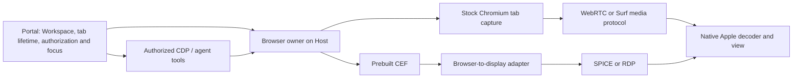

# Open-source foundations for Portal’s remote browser

## Assessment

Existing projects solve substantial parts of this problem. A custom Chromium compositor is one possible implementation, but it is not a prerequisite for a Portal-owned browser with native clients. The most useful open-source options are **Surf as a browser-specific implementation and reusable client core; upstream Chromium plus maintained WebRTC components; and CEF plus an existing remote-display protocol**. Each moves the maintenance boundary in a different direction.

The strongest new finding is Surf. It combines Chromium tab capture on macOS and Linux, a Go backend, native iOS presentation, and a portable C99 client core with a documented porting interface. Its current product targets legacy jailbroken iOS, so it cannot be installed unchanged on the current iPad. Its reusable parts nevertheless deserve investigation before writing equivalent browser lifecycle, input and media-policy code.[^1][^2]

For a conventional retained display protocol, **CEF → SPICE → CocoaSpice** is a credible composition. CEF supplies rendered pixels and dirty rectangles through a maintained embedding API; SPICE supplies display, caching, input and audio mechanisms; CocoaSpice supplies an existing native Apple integration. SPICE's application-side API can be used without a VM. The proposed adapter has not been built, and shared-viewer behavior is a significant risk.[^7][^10][^11][^12]

For the lowest immediate implementation risk, the existing **stock-Chromium tab capture → native libwebrtc** slice remains the strongest locally demonstrated baseline. A Host-local LiveKit server and its higher-level SDKs could remove more signaling and subscription code while retaining that browser capture path. That is a new integration to validate; the current experiment uses the prebuilt WebRTC dependency without adopting LiveKit rooms or its server.[^15][^16][^17]

No reviewed open-source package combines all of the required Host platforms, modern embeddable Apple clients, independent browser tabs, persistent Workspace profiles, concurrent passive viewers, focus-controlled viewport sizing and unrestricted authorized agent debugging as an already accepted integration. This is a finding about the public artifacts and interfaces reviewed, not a claim that no other implementation exists.

## Requirements and evidence baseline

The comparison retains Chromium execution on both macOS and Linux Hosts, a persistent browser profile per Workspace, and native macOS/iPad display without a webpage-rendering webview. Browser work continues without viewers. Audio remains required. Portal authorizes access, and the latest client to activate or focus a tab controls its server viewport; passive viewers follow. Authorized ACP agents need control and debugging through Portal independently of whether a human is attached.

The precise post-aggregation Viz boundary is optional in this comparison. Both video and partial/cached image updates are eligible. Open-source dependencies are required; commercial services and source-available software that do not meet that requirement are excluded from adoption recommendations. Chromium is the open-source engine/project; the earlier Google Chrome/Chrome for Testing runs are compatibility evidence, not proof that the branded browser distribution is an entirely open-source deliverable. An adopted Chromium binary needs its own extension, codec and update validation. Official Chromium snapshot binaries are best-effort builds and do not necessarily correspond to a Chrome release.[^40] Repository license declarations are recorded as dependency facts, not as a completed distribution-license assessment.

Public artifacts and documentation were checked on **12 September 2026**. Candidate findings are source/API evidence unless an actual local result is identified. The existing [WebRTC feasibility results](../../experiments/browser-streaming/RESULTS.md) record Mac and Linux Hosts, native Mac/iPad reception, audio energy, viewport handoff, unattended work and physical iPad video/tone confirmation. They do not establish representative page performance or production integration. The separate [Viz measurements](../../experiments/remote-viz-spike/docs/measurements.md) distinguish synthetic replay from actual Chromium replay; its initial full Chromium build was still running during this research.

## The reusable boundaries

Four different systems can all be described as remote rendering. They provide different building blocks:

| Boundary | What crosses the network | Existing examples | Consequence for Portal |
| --- | --- | --- | --- |
| Browser compositor or paint operations | Drawing state and separately managed assets | Historical Blimp/Garnet; proprietary Cloudflare NVR | Highest exposure to browser rendering internals; no maintained open-source turnkey native package identified |
| Application/window display | Rectangle updates, images, cached graphics, optional video | SPICE, RDP, RFB, Xpra | Reuse an established display protocol; supply a browser or window producer |
| Encoded browser media | Video/audio plus control messages | Surf, Chrome tab capture with WebRTC, Neko | Avoid implementing browser composition; choose existing or custom media/session machinery |
| Browser document replication | DOM/style/resources rendered by the receiving browser | Browser-based co-browsing systems | Requires a browser engine on the client; conflicts with the thin native display requirement |

The first two are not interchangeable. A SPICE image-cache hit or RFB CopyRect operation can save transmitted pixels, but it does not establish that Chromium exported an original composited layer and its transform. Conversely, video compression is not equivalent to sending an independent full screenshot every frame: codecs exploit temporal redundancy, and AV1 includes screen-content tools such as palette coding and intra-block copy. Codec support alone does not establish that a particular Apple WebRTC path uses those tools efficiently.[^10][^23][^31]

The media library does not need to own Portal's Workspace model. Keeping that boundary explicit also permits replacing a display transport without transferring profile ownership or agent authorization into it.

## Candidate matrix

“Prebuilt” identifies the reusable artifact, not a claim that the whole Portal feature ships ready-made. Native Mac hosting excludes running a Linux VM on a Mac.

| Candidate | Open-source unit / artifacts | macOS + Linux Host fit | Native Apple fit | Assessment |
| --- | --- | --- | --- | --- |
| **Surf** | MIT; Host packages; C99 client core | Both documented | Existing legacy iOS client; modern port required | Closest browser-specific source-reuse candidate |
| **Stock Chrome + libwebrtc** | Chromium and maintained WebRTC distribution | Both demonstrated locally | Mac/iPad demonstrated locally | Lowest-risk implementation baseline |
| **Stock Chrome + LiveKit** | Apache-2.0 server/SDKs; prebuilt WebRTC dependency | Host-local server supported | Native Swift SDK | Best targeted test for reducing media/session glue |
| **CEF + SPICE + CocoaSpice** | CEF binary SDK; LGPL SPICE stack; Apache-2.0 CocoaSpice wrapper | Native library builds/packages exist | Existing Mac/iOS bindings and Metal surfaces | Best composed partial/cached-image alternative; adapter and viewer policy remain |
| **CEF/Electron + IronRDP/FreeRDP** | Browser binaries and reusable RDP libraries | Plausible custom producer; existing Mac desktop servers have limits | Native RDP components exist; packaging varies | Credible second protocol option, weaker immediate Apple embedding story |
| **Sunshine + Moonlight** | GPL server/client/core; Mac/Linux packages | Mac support documented as experimental | Existing native apps and C client core | Strong prebuilt desktop route; changes isolation and capture scope |
| **Neko** | Apache-2.0 browser/container appliance | Linux stack; Mac requires Linux runtime | Web client; native adaptation needed | Attractive if Host/platform model changes |
| **Selkies / Wolf** | MPL-2.0 / MIT projects; Linux packages/containers | Linux display/audio stack | Selkies web client / Wolf uses Moonlight | Strong Linux application-streaming foundations |
| **Xpra / RFB** | Existing app-remoting or framebuffer libraries | Linux app sessions; Mac modes differ | Mac clients; iPad embedding work | Useful comparison/control paths, not complete browser ownership |
| **Electron / Qt WebEngine** | Maintained Chromium embedding distributions | Both Host platforms | Output still needs transport and native client | Reusable browser hosts; no Viz-export shortcut |
| **Carbonyl / Blimp / Garnet** | Open-source or historical research artifacts, with differing license status | Varies; old browser revisions | Different or unfinished clients | Architectural precedents, unsuitable default dependencies |

Each row is expanded below or in the linked [display-protocol](wve-79/alternatives-display-protocols.md), [streaming-stack](wve-79/alternatives-streaming-stacks.md) and [vector-product](wve-79/alternatives-vector-products.md) appendices. The appendices preserve narrower source and release findings.

## Surf: the closest browser-specific implementation

Surf's release **v0.17.0, dated 9 September 2026**, advertises native iOS and macOS/Linux/Windows backend packages. Its Host uses an installed compatible Chrome/Chromium/Edge or a managed browser, captures tabs through an extension, and persists its profile under a configurable application directory. This is a concrete browser service, rather than merely a screen-capture sample.[^1][^3]

Its reusable client boundary is unusually clear. The C99 core handles protocol parsing, browser-state updates, effects, input ordering and media admission/recovery. The platform adapter owns transport, identity storage, decoder, graphics, audio and UI. The header exposes an ABI version and creation/dispatch/snapshot functions, so a modern Swift host could wrap the core instead of copying every state transition. That is an integration inference supported by source, not a completed Swift SDK.[^2][^4]

The media path differs from the current WebRTC slice. Surf's offscreen extension feeds a captured track into `MediaStreamTrackProcessor` and `VideoEncoder`, requests H.264 Annex B with software encoding, and forwards encoded data over WebSockets. Audio is signed 16-bit mono PCM at 16 kHz. Its custom binary envelope carries generations, sequences and timing metadata. Consequently, adopting its media path also adopts its queueing, recovery and transport conventions; it does not remove all custom protocol maintenance.[^5][^6]

The limits matter more than the similarity:

- The published iOS target ends at iOS/iPadOS 14.8.1 and requires a rootful jailbreak. The stated hardware verification is an original iPad mini on iOS 6.1.3. Its decoder has legacy dynamic framework loading, including a private-framework path. A modern supported iPad app needs a proper public-API port and device acceptance.[^1][^4][^37]
- The browser controller has one shared active tab and view dimensions; all viewers subscribe to the same video stream. Size commands update those shared dimensions without a client-specific focus lease. Portal's independent tabs and passive-viewer policy therefore require controller changes before wholesale adoption.[^38]
- Surf owns pairing, authentication, profile recovery and session control. Portal already owns the analogous product authority. Running an instance per Workspace is plausible, but integrating that ownership and exposing authorized full CDP access remains work; the client protocol is not a general CDP passthrough.[^6][^38]
- Its software-encoder choice and raw PCM target legacy devices. Those choices should be compared against native libwebrtc on current Apple hardware, rather than accepted as performance improvements.[^5]

**Recommendation:** audit and prototype reuse of Surf's portable core and browser/input handling, while keeping a direct comparison with the existing harness. Do not replace the working media stack merely because Surf has more browser UI. The useful question is whether an independent native client and Portal adapter can consume a maintained upstream interface with fewer changes than implementing the missing product behavior locally.

## CEF plus SPICE: a maintained browser and established display protocol

CEF changes the maintenance obligation substantially: its C/C++ embedding interfaces insulate applications from Chromium/Blink internals, and its binary distributions mean that the application can compile a small host against an existing browser engine. The build index contains stable **CEF 152.0.6 / Chromium 152.0.7977.83** packages for Mac arm64/x64 and Linux x64/arm64, as well as newer beta entries. These are verified listed artifacts, not an adopted security/update pin. The captured metadata is in [artifact evidence](wve-79/alternatives-artifact-evidence.json).[^7][^8]

The relevant public interfaces already exist: `OnPaint` supplies BGRA output and dirty rectangles; `OnAcceleratedPaint` supplies a completed image through a local GPU handle with lifetime constraints; browser-host methods supply resize and input; `CefAudioHandler` supplies browser PCM; DevTools methods provide browser control/debugging. This is a viable source for a media or display adapter without modifying Chromium. Windowless rendering still needs platform validation: it should not be assumed to mean every Linux package runs without a display service or that every browser/CDP feature matches stock Chrome.[^7][^9][^39]

SPICE is more than a VM viewer. Its server is a library with a Virtual Device Interface; display, cursor, input and audio channels are separate. It supports image compression and client-side image/palette caching. The official test producer in the 0.16.0 source release instantiates a QXL interface and submits drawing/bitmap commands directly, demonstrating that QEMU and Xorg are not prerequisites for using the library.[^10][^11]

A concrete initial composition would be:

1. The adapter copies CEF's changed image regions into owned buffers during the rendering callback.
2. A small Host adapter submits those regions through the SPICE drawing interface and respects its release callbacks.
3. `spice-server` handles display encoding, protocol state and client delivery.
4. CocoaSpice receives the stream and exposes native Apple display/cursor surfaces; its existing dependencies provide protocol and media support.
5. Input returns through the adapter to CEF. Browser audio feeds the playback interface. Portal determines which attachment may change the browser size.

Homebrew distributes `spice-server` bottles for Mac and Linux. CocoaSpice is already used in UTM and exposes Metal-oriented display surfaces on Apple platforms. Its wrapper being Apache-2.0 does not make the whole dependency graph Apache-2.0: spice-gtk, GLib, GStreamer and selected codecs have their own packaging and license requirements.[^12][^13]

**The main unresolved problem is concurrent viewing.** The reviewed SPICE server normally disconnects an existing client when a new one connects. Multiple-client mode is experimental and environment-gated in the release. Enabling it is not acceptance of our shared passive-viewer requirement. Separate per-viewer server processes or an adapter fan-out could work, but would add state and processing that must be measured before calling this the simpler solution. The upstream source describes one server per process as the intended model, so multiple viewers should not be assumed to cost only another small in-process object.[^11]

This approach would transmit final-image changes, not preserve original Viz layers. Dirty rectangles alone do not tell the adapter that an element moved without repainting: that motion is already baked into changed output pixels. SPICE caching/compression may still make it useful, but actual browser workloads must establish its quality, bandwidth and CPU benefit. A compositional protocol does not automatically recover semantics its producer never supplied.

**Recommendation:** keep CEF→SPICE→CocoaSpice as the strongest bounded alternative experiment if the aim is lossless text and partial/cached image transport. Require two-viewer behavior, modern iPad packaging, browser audio and display-less Linux operation early. Lossless text is a configuration and acceptance goal: SPICE can also select lossy image/video modes. A successful single-client synthetic SPICE demo would leave those questions open.

## RDP, RFB and application remoting

IronRDP is a modular Rust RDP implementation with server-building components, codecs, input, audio and resize-related facilities. FreeRDP supplies a mature Apache-2.0 implementation and client/server libraries. They can provide a protocol instead of inventing one, but still need a producer that owns and captures the browser. FreeRDP's Mac shadow-server source explicitly marks itself unmaintained; its existence should not be presented as maintained per-tab Mac hosting.[^14]

MacRDP provides a newer concrete Mac server and prebuilt Apple Silicon release, using IronRDP. Its documented scope is a single-user desktop session. That can run a stock browser under CDP, but desktop capture and shared OS input are different from independent authorized Workspace browser surfaces. The display appendix distinguishes actual release assets from repositories that only describe planned or source-build clients.[^14]

RFB provides an even simpler framebuffer/input boundary. CopyRect can reuse a rectangle already held by the client, but the producer must identify a valid copy; a CEF dirty rectangle alone does not provide the source coordinates. RFB's base specification also does not provide browser audio, so selecting it generally creates a second media integration. Native library reuse is real, while full browser control, profiles and audio remain separate responsibilities.[^23]

Xpra is attractive for persistent individual Linux applications, with existing window forwarding and audio. Its Mac server modes do not establish the same isolated Linux-style application sessions, and a modern embeddable iPad client was not verified. Waypipe and Greenfield operate around Wayland, which can preserve application-buffer boundaries but introduces a Linux/Wayland environment. Accepting that environment on a Mac Host resolves only one side: Waypipe still expects a receiving Wayland compositor, while Greenfield's existing receiver is browser-based. A native Apple client/compositor remains additional work.[^14]

## Stock Chromium and maintained media components

The existing WebRTC slice already avoids a Chromium fork. A bundled extension supplies tab audio/video, Chromium handles the encoder and WebRTC endpoint, and the native Apple side uses a maintained prebuilt WebRTC framework. Portal-specific code remains in browser supervision, capture selection, signaling, focus/viewport policy and input. That is a narrower maintenance surface than implementing the browser's compositor semantics.

The most targeted further composition is the **full LiveKit SDK plus a Host-local server**. Its JS API accepts existing `MediaStreamTrack` instances, and its Swift SDK includes a native video view. Publishing our already captured tracks is therefore a plausible path. It could replace more connection, subscription and recovery glue, while adding a server process and a room/track model. Local hosting preserves LAN/VPN deployment; it changes direct peer-to-peer media into a server-mediated path.[^15][^16][^17]

This must be compared as a trade: a library that supplies more lifecycle machinery can reduce application code, but an additional service is still an operational dependency. Adaptive video dimensions also do not implement authoritative browser viewport ownership. Portal must retain the focus rule, CDP authorization and profile lifetime, regardless of the SDK's room or participant concepts.

GStreamer provides another open-source composition layer: native distributions, WebRTC sink/source elements, encoder and congestion machinery, and navigation/control-channel facilities. It is particularly useful with an offscreen/native producer. It leaves the CEF capture binding, input conversion and Apple UI integration to the application. Its WPE browser example uses WebKit, so it cannot be treated as a prebuilt Chromium backend.[^18]

**Recommendation:** compare LiveKit's full SDK against direct libwebrtc before adding a custom browser fork for product delivery. The experiment can reuse the current browser, fixture pages and native devices. Measure reconnection behavior, multiple viewers, encode/relay overhead and maintained adapter code. No new Chromium build is needed.

## Complete prebuilt browser and desktop stacks

Neko supplies a real Apache-2.0 browser appliance with ready-made images, collaborative control and APIs. Its display/audio backend is Linux/X11/GStreamer/PulseAudio. That can substantially reduce server code on Linux; a native Apple client still needs its signaling/input integration, and Mac execution would involve a Linux runtime. The current v3 migration changes internal media/input details, so a stable HTTP API does not establish a stable drop-in native client protocol.[^19]

Selkies supplies a broader Linux streaming stack. Current documentation describes default WebSocket/WebCodecs transport and optional WebRTC, with new capture/audio components. Its release candidate and dependency options matter: treating every current build as the older GStreamer architecture, or assigning one top-level license to every codec, would be misleading. Wolf supplies isolated Linux virtual desktops and Moonlight-compatible streaming, with reusable compositor components.[^20][^22]

Sunshine/Moonlight is a stronger immediate native-client option. Current Sunshine releases contain Mac and Linux packages; Moonlight has native Mac/iOS apps and a reusable C streaming core. Current Mac audio support exists, although Mac support remains described as experimental. Its capture boundary is a display and system audio, and multiple instances are discouraged. Turning that into independent browser tabs would require isolation and ownership work rather than merely launching separate Chrome profiles.[^21]

These projects are valuable alternatives if the product accepts a **remote application/desktop session**, or a Linux browser service inside a managed VM on Mac. That is a genuine architecture option with substantial upstream reuse. It changes resource cost, filesystem locality, Host operation and agent access to services on the Mac; it should be chosen explicitly rather than hidden behind “runs on macOS.”

## Compositor remoting precedents and misleading shortcuts

Carbonyl demonstrates the build split we want: a modified Chromium headless runtime loads a separate Rust library, and developers can replace that library in an existing release. Its interface exposes text/bitmap operations, not a retained Viz pass graph. The original project's latest observed release uses Chromium 111 and dates to 2023. A maintained fork, `jmagly/carbonyl`, ships a newer Chromium 150 Linux prerelease with the same replaceable-library idea; current Mac release assets were not verified despite broader install documentation. Neither supplies a full-fidelity retained browser graph. The original project is historical prior art, and the fork deserves a separate, narrower assessment rather than being dismissed as abandoned.[^24]

Blimp and Garnet show that browser drawing-command remoting is technically real. Blimp was removed from Chromium in 2017. Garnet is a research implementation using modified Chromium and CanvasKit/Wasm, with old activity and no verified distributable maintained SDK. Both are useful for understanding separation and resource handling; neither removes the current build/maintenance obligation.[^25]

Cloudflare's NVR provides a commercial technical precedent for Skia-command transport, but its public offering does not supply an eligible open-source native SDK. Hyperbeam, BrowserBox, Browserbase and current Browserless are excluded from the shortlist under the open-source constraint. BrowserBox's historical licensing descriptions are especially unsafe to reuse: its current distribution is explicitly proprietary. These exclusions say nothing about their quality as commercial products.[^26]

Qt WebEngine and Electron are maintained ways to embed Chromium, but both expose a completed browser image to their surrounding graphics system. Electron's offscreen API can produce bitmaps or local shared textures with dirty-region metadata; Qt documents importing Chromium's final image into its scene graph. They can replace a custom browser host, not supply the missing Viz network exporter. Historical Qt Quick WebGL streaming is also a trap: it streamed Qt Quick GL commands and was removed in Qt 6; it is not a current Chromium-remoting SDK.[^27][^28][^29]

Skia or WebRender can be reused as renderers, but neither alone provides an upstream Chrome API producing a compatible, synchronized network stream. Replacing Metal drawing code with another renderer does not remove capture, resource identity, lifetime, codec and browser-version responsibilities. The vector appendix records the available precedents and their limitations.[^25]

## Recommended next decisions and experiments

The initial selection should be driven by **maintained custom surface area**, then by measured behavior on development pages. A broad feature count or the existence of a prebuilt desktop app does not establish low-cost integration into Portal.

| Priority | Bounded experiment | Decision it resolves | Stop or reconsider when |
| --- | --- | --- | --- |
| 1 | Audit Surf core/backend interfaces against Portal and build a modern native adapter only if reuse remains narrow | Reuse upstream browser/input/state machinery, or borrow selected lessons | Independent tabs and Portal authority require deep controller changes; legacy client port dominates |
| 2 | Publish current extension tracks through a Host-local LiveKit server to native Swift clients | Whether higher-level SDKs reduce enough glue to justify the extra service | It adds operational/model complexity without reducing our maintained media code |
| 3 | CEF dirty-region producer → SPICE → CocoaSpice, starting with one then two viewers and browser audio | Whether standard cached/partial display transport is a viable full native alternative | Concurrent viewers, iPad dependencies or platform setup require bespoke protocol machinery |
| Control | Sunshine/Moonlight or Neko on appropriate hardware | Quality, latency and operations of existing complete stacks | Required isolation changes the product into a desktop/VM feature |
| Existing research | Finish the current Viz capture/replay gate | Whether exact raster-resource reuse gives enough benefit to justify a fork | Resource churn, missing semantics or maintenance outweigh measured benefit |

A common acceptance corpus should include small text at intended DPR, terminal-like web apps, scrolling, animations, cross-origin iframes, popups, forms/IME, audio and two viewers with different viewport preferences. Measure input-to-visible-update latency, actual encoded/wire bytes, CPU, memory, reconnect cost and focus handoff. Mark tested combinations explicitly; a supported codec, a successful build and a shipped desktop app are different evidence levels.

The recommended production starting point remains upstream Chromium with maintained media components. **Surf is the first codebase worth an adoption audit; CEF→SPICE→CocoaSpice is the first conventional display-protocol composition worth a targeted test.** The Viz experiment should establish whether the stronger resource-reuse property pays for its additional ownership burden, rather than becoming the default because its initial build has already consumed time.

## Sources

The linked technical appendices contain further primary-source citations, release checks and candidate-specific limits. Dates below identify an inspected release when applicable; living documentation was checked on 12 September 2026.

[^1]: seg6, [Surf README](https://github.com/seg6/surf), Host/client compatibility and architecture.
[^2]: seg6, [Surf client architecture](https://github.com/seg6/surf/blob/main/docs/client-architecture.md), core/platform responsibilities.
[^3]: seg6, [Surf v0.17.0](https://github.com/seg6/surf/releases/tag/v0.17.0), 9 September 2026.
[^4]: seg6, [Porting Surf clients](https://github.com/seg6/surf/blob/8923842c69095241412cafa7abe1845d58dd4e74/docs/porting-clients.md) and [core API](https://github.com/seg6/surf/blob/8923842c69095241412cafa7abe1845d58dd4e74/client/core/include/surf/core.h), inspected source revision.
[^5]: seg6, [Offscreen capture and encoder](https://github.com/seg6/surf/blob/8923842c69095241412cafa7abe1845d58dd4e74/backend/internal/media/extension/offscreen.js), inspected implementation.
[^6]: seg6, [Surf client protocol](https://github.com/seg6/surf/blob/8923842c69095241412cafa7abe1845d58dd4e74/docs/protocol.md), media envelope and typed control.
[^7]: Chromium Embedded Framework, [project](https://github.com/chromiumembedded/cef) and [render handler](https://github.com/chromiumembedded/cef/blob/master/include/cef_render_handler.h), public embedding/rendering interfaces.
[^8]: CEF, [automated build index](https://cef-builds.spotifycdn.com/index.json) and [download interface](https://cef-builds.spotifycdn.com/index.html), platform/version artifact metadata.
[^9]: CEF, [audio handler](https://github.com/chromiumembedded/cef/blob/master/include/cef_audio_handler.h), browser PCM callback.
[^10]: SPICE project, [user manual](https://www.spice-space.org/spice-user-manual.html), server library, channels, compression and caching.
[^11]: SPICE project, [0.16.0 source release](https://www.spice-space.org/download/releases/spice-0.16.0.tar.bz2), `server/tests/test-display-base.cpp`, `server/spice-qxl.h`, `server/reds.cpp` and `README`; detailed source findings in the display-protocol appendix.
[^12]: UTM, [CocoaSpice](https://github.com/utmapp/CocoaSpice), native Apple wrapper and dependencies.
[^13]: Homebrew, [spice-server formula](https://formulae.brew.sh/formula/spice-server), native binary package availability.
[^14]: Devolutions, [IronRDP](https://github.com/Devolutions/IronRDP); FreeRDP, [Mac shadow source](https://github.com/FreeRDP/FreeRDP/blob/e5f2cf530fa4dbf4166839799c1e0d7f9640355a/server/shadow/Mac/mac_shadow.c); Clint, [MacRDP](https://github.com/clintcan/macrdp); Xpra, [clients](https://github.com/Xpra-org/xpra/blob/master/docs/Usage/Clients.md) and [shadow mode](https://github.com/Xpra-org/xpra/blob/master/docs/Usage/Shadow.md). Further source and artifact detail in the [display appendix](wve-79/alternatives-display-protocols.md).
[^15]: LiveKit, [local server](https://docs.livekit.io/transport/self-hosting/local/) and [Swift platform support](https://docs.livekit.io/transport/sdk-platforms/swift/).
[^16]: LiveKit, [JS publishTrack API](https://docs.livekit.io/reference/client-sdk-js/classes/LocalParticipant.html#publishTrack), existing media-track publishing.
[^17]: LiveKit, [Swift VideoView at 2.16.0](https://github.com/livekit/client-sdk-swift/blob/2.16.0/Sources/LiveKit/Views/VideoView.swift) and [WebRTC distribution](https://github.com/livekit/webrtc-xcframework), native rendering and packaging.
[^18]: GStreamer, [downloads](https://gstreamer.freedesktop.org/download/), [rswebrtc](https://gstreamer.freedesktop.org/documentation/rswebrtc/index.html) and [webrtcsink](https://gstreamer.freedesktop.org/documentation/rswebrtc/webrtcsink.html), native media composition.
[^19]: Neko, [installation](https://neko.m1k1o.net/docs/v3/installation), [capture](https://neko.m1k1o.net/docs/v3/configuration/capture) and [v3 migration](https://neko.m1k1o.net/docs/v3/migration-from-v2).
[^20]: Selkies, [current components](https://selkies-project.github.io/selkies/component) and [v2.0.0rc0](https://github.com/selkies-project/selkies/releases/tag/v2.0.0rc0), release candidate dated 12 September 2026.
[^21]: Sunshine, [v2026.906.222525](https://github.com/LizardByte/Sunshine/releases/tag/v2026.906.222525), [Mac audio implementation](https://docs.lizardbyte.dev/projects/sunshine/v2026.906.222525/interfaceAVAudio.html); Moonlight, [C core](https://github.com/moonlight-stream/moonlight-common-c). See streaming appendix for installation limits.
[^22]: Games on Whales, [Wolf architecture](https://games-on-whales.github.io/wolf/stable/dev/how-it-works.html) and [repository](https://github.com/games-on-whales/wolf).
[^23]: IETF, [RFC 6143: The Remote Framebuffer Protocol](https://www.rfc-editor.org/rfc/rfc6143.html), March 2011, especially CopyRect and input messages.
[^24]: Fathy Boundjadj, [Carbonyl README](https://github.com/fathyb/carbonyl/blob/main/readme.md) and [releases](https://github.com/fathyb/carbonyl/releases); jmagly, [Carbonyl alpha.18 release](https://github.com/jmagly/carbonyl/releases/tag/v0.2.0-alpha.18) and [runtime/core boundary](https://github.com/jmagly/carbonyl/blob/e55e663777881033fd239ac0a88af0a3dd78d908/docs/rust-chromium-boundary.md), original and maintained-fork artifact/interface evidence.
[^25]: Chromium, [Blimp compositor](https://raw.githubusercontent.com/chromium/chromium/da3cfdb3e1f0b69e10aaadc30ff05811c26f46af/blimp/client/core/compositor/blimp_compositor.cc) and [removal commit](https://github.com/chromium/chromium/commit/7ab5fc81962a872e9dae8c54493360bac7d3d69d), 18 January 2017; ECS-251-W2020, [Garnet](https://github.com/ECS-251-W2020/garnet) and [UNLICENSED package](https://github.com/ECS-251-W2020/garnet/blob/master/server/package.json); Chromium, [paint serialization discussion](https://groups.google.com/a/chromium.org/g/blink-dev/c/dxe6uFMNOtM), April 2024. Further detail in the [vector appendix](wve-79/alternatives-vector-products.md).
[^26]: Cloudflare, [NVR architecture](https://blog.cloudflare.com/cloudflare-and-remote-browser-isolation/); BrowserBox, [current product contract](https://github.com/BrowserBox/BrowserBox/blob/v18.8.0/README.md); Browserless, [license](https://github.com/browserless/browserless/blob/v2.56.7/LICENSE); Hyperbeam, [SDK reference](https://docs.hyperbeam.com/client-sdk/javascript/reference); Browserbase, [live view](https://docs.browserbase.com/platform/browser/observability/session-live-view). Further current offering/edition evidence in the streaming and vector appendices.
[^27]: Electron, [offscreen rendering](https://www.electronjs.org/docs/latest/tutorial/offscreen-rendering) and [shared-texture object](https://www.electronjs.org/docs/latest/api/structures/offscreen-shared-texture), local output/lifetime contracts.
[^28]: Qt, [WebEngine features](https://doc.qt.io/qt-6/qtwebengine-features.html), final-image graphics integration and DevTools.
[^29]: Qt, [Qt Quick WebGL release](https://www.qt.io/blog/2018/11/23/qt-quick-webgl-release-512), 23 November 2018, and [Qt 6 removed modules](https://wiki.qt.io/New_Features_in_Qt_6.0#Removed_Modules), historical scope and removal.
[^31]: Alliance for Open Media, [AV1 Tool Description](https://aomedia.org/docs/AV1_ToolDescription_v11-clean.pdf), section 3.8, screen-content coding; no measured claim about the current Apple client.
[^37]: seg6, [legacy iOS video decoder](https://github.com/seg6/surf/blob/8923842c69095241412cafa7abe1845d58dd4e74/client/ios/Classes/RBVideoDecoder.m), inspected dynamic framework-loading implementation.
[^38]: seg6, [browser controller](https://github.com/seg6/surf/blob/8923842c69095241412cafa7abe1845d58dd4e74/backend/internal/browser/controller.go), [tab/view control](https://github.com/seg6/surf/blob/8923842c69095241412cafa7abe1845d58dd4e74/backend/internal/browser/tabs.go) and [backend contract](https://github.com/seg6/surf/blob/main/docs/backend.md), shared active state, profile/lifecycle and CDP integration.
[^39]: CEF, [browser-host interface](https://github.com/chromiumembedded/cef/blob/master/include/cef_browser.h), resize, input and DevTools methods.

[^40]: Chromium, [project](https://www.chromium.org/Home/) and [binary distribution guidance](https://www.chromium.org/getting-involved/download-chromium/); Google, [Chrome additional terms](https://www.google.com/chrome/terms/), modified 30 September 2025, separates executable terms from open-source component licenses.
