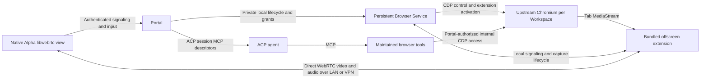

# Portal-owned Chromium browser streaming

## Recommendation and decision status

The recommended feasibility design is a persistent Browser Service behind Portal, running upstream unified headless Chrome with one persistent profile per Workspace. A small Manifest V3 extension captures each viewed tab's audio/video and gives those tracks directly to Chromium's WebRTC implementation. Native libwebrtc views in Alpha receive the media on macOS and iPad. Portal remains the authority for browser lifetime, access, signaling, focus, and input.

WebRTC and browser audio are required from the first native spike, with both macOS and Linux Hosts supported. Initial connectivity is direct over LAN/VPN. JPEG/PNG streaming is retained only as diagnostic evidence and a lossless visual reference; it is not the proposed implementation sequence.

A local macOS experiment on stock Chrome 153 confirms headless extension activation, tab capture, H.264/Opus negotiation, decoded video, and a nonzero received audio signal between two Chromium WebRTC peers. This resolves a material capture feasibility question without a Chromium fork or separate encoder. It does not prove Linux operation, native Apple interoperability, network quality, multi-tab behavior, or product persistence. Those remain acceptance gates.

No reviewed component supplies the complete requested product as a small native SDK. The extension approach concentrates the custom media work in capture lifecycle and signaling while reusing Chromium for capture/encoding and native libwebrtc for reception. The extension/native-libwebrtc backend is accepted as the research design, subject to the native/platform spike. This is architectural agreement, not runtime acceptance.

| Decision | Status | Direction |
| --- | --- | --- |
| Initial scope | Accepted | Development and agent work; broader browser features later |
| Page execution | Required | Upstream Chromium on the Host |
| Client display | Accepted | Native decoding and presentation of pixels/video |
| Chromium fork | Excluded from recommendation | Use upstream browser or maintained embedding APIs |
| Viewport authority | Accepted | Latest client activation/focus, per tab; passive viewers follow |
| Profile scope | Accepted | Separate persistent browser profile per Workspace |
| Agent work without viewers | Accepted | Continue authorized browser work; stop unused display capture |
| Host platforms | Accepted | Both macOS and Linux from the start |
| Initial media | Accepted | WebRTC video and browser audio from the start |
| Initial network | Accepted | Direct Host connectivity over LAN/VPN; no initial TURN deployment |
| Capture backend | Accepted, subject to validation | MV3 tabCapture and offscreen document using Chromium WebRTC |
| Apple media stack | Accepted | Native libwebrtc; specific maintained XCFramework distribution subject to packaging validation |
| Webpage accessibility | Deferred | No native webpage VoiceOver bridge in the first version; browser controls remain accessible |
| Feasibility implementation | Started | Standalone Host/native slice; product integration remains pending |

The authorized implementation slice and its newer cross-platform evidence are recorded in [WVE-79 feasibility results](../../experiments/browser-streaming/RESULTS.md). Those results supersede the earlier local-only limits below where explicitly stated; the original probes remain reproducible historical evidence.

## Current Weave architecture

This analysis inspected repository commit `99504a98b5bae6c3fd083635eb43ca9434295332`. The working tree was clean at the start. Historical notes were used for orientation; current source established the implementation facts below.

| Current seam | Observed behavior | Browser implication |
| --- | --- | --- |
| `product/portal/src/terminal-service/README.md` and ADR 0005 | A separate local service owns PTYs and authoritative libghostty state; Portal is the remote authority | Reuse the ownership and independent-lifetime pattern |
| `product/portal/src/terminal-service/contract.ts` | Bounded local IPC, explicit discovery, lifecycle and compatibility | Keep browser ownership local and independently discoverable |
| `product/portal/src/terminals.ts` | Shared input is serialized; latest input sender owns terminal size | Browser activation-based ownership is a deliberate new policy |
| `product/protocol/src/terminal-wire.ts` | JSON control plus an opaque binary terminal payload, with terminal-specific framing | Reuse transport principles, not the terminal codec or magic bytes |
| `product/alpha/native/ghostty/README.md` | Shared native rendering with AppKit/Electron and UIKit/Capacitor adapters | Add a native browser display surface beside the terminal surface |
| `product/portal/src/thread-runtime.ts` | New/load/recovery flows accept `mcpServersForThread` | Existing ACP setup can inject browser tools |
| `product/portal/src/portal.ts` | Browser methods reject as unavailable; relevant Thread paths currently supply empty MCP server lists | Browser control is not an active subsystem to extend in place |
| ADR 0002 and `product/deferred` | Previous client-owned, attended Browser is explicitly retired | Reuse lessons selectively; do not inherit its visibility requirement |

The Terminal Service owns a state machine that clients can reconstruct using public libghostty snapshots and subsequent terminal bytes. It does not render images on the Host. Chromium instead owns layout, JavaScript, fonts, compositing, media, and many browser services. In the proposed browser design, clients reproduce the visible output, not that browser state.

Restart survival must be equally explicit. A surviving Browser Service and its Chromium processes can preserve live tabs across Portal/client restarts. A browser crash or Host reboot cannot preserve arbitrary JavaScript heaps, network connections, or unsaved in-memory application state. Persisted profiles and session restoration are a different recovery class.

The current domain also needs future specification work: Workspaces currently exist while they contain terminals or active Threads, and active Panes are terminals. Adding a Browser Pane must address Workspace existence and close behavior. This report does not change the glossary or record a new accepted ADR.

## Why drawing-command replication is not the preferred path

Chromium's Viz implementation includes compositing services, frame sinks, resources, GPU presentation, and capture interfaces. Its documented interfaces are part of Chromium's own graphics and IPC architecture. They are not a documented standalone, versioned remote-browser protocol for third-party native clients. Extracting them would introduce resource-lifetime, GPU, serialization, and Chromium-version coupling. That maintenance assessment is an inference from the component boundaries, not proof that remoting is impossible. [1](https://raw.githubusercontent.com/chromium/chromium/main/components/viz/README.md)

Cloudflare demonstrates that drawing-command remoting is possible. Its Network Vector Rendering architecture captures Skia commands and replays them using client code, originally described with a WebAssembly renderer. This establishes a technical precedent, but the reviewed material does not provide a self-hosted embeddable native SDK for Portal. A commercial service or bespoke Chromium integration would change the dependency model substantially. [2](https://blog.cloudflare.com/cloudflare-and-remote-browser-isolation/)

DOM serialization is also insufficient as a thin native display protocol. Recreating arbitrary pages from DOM/CSS requires layout, text shaping, painting, canvas, and multimedia behavior; a DOM snapshot is useful evidence for agents, but it is not a replacement rendering engine. With native pixel display accepted, this direction offers little value for WVE-79.

## Candidate implementations

The judgments below compare integration shape, not benchmark performance. Licensing entries report upstream declarations and are not a conclusion about Weave distribution compatibility.

| Candidate | Reusable capability | Remaining burden | Assessment |
| --- | --- | --- | --- |
| Unified headless Chrome + MV3 capture + WebRTC | Full browser runtime, per-tab audio/video capture, built-in media encoding/transport | Extension lifecycle/signaling, native input, session ownership and Apple views | Recommended first native feasibility path |
| CDP JPEG/PNG screencast | Captured images and metadata | Separate audio and temporal video compression absent | Diagnostic reference; excluded as initial implementation |
| CEF offscreen rendering | Maintained embedding API, pixels or GPU surfaces, browser callbacks | C++ browser host, packaging, capture-to-codec integration, native clients | Strong fallback when direct frame access is necessary |
| Electron offscreen rendering on Host | Chromium with JS host API and bitmap/shared-texture output | Additional Electron Host distribution, native encoder bridge, display delivery | Compare against CEF before adopting a new native browser host |
| Neko | Collaborative virtual browser/application, WebRTC, audio, shared control | Linux display/session environment and custom native client integration; application stream differs from independent tab streams | Reference only; does not satisfy both Host platforms |
| Selkies | Linux desktop streaming, codecs, input, clipboard, optional WebRTC | HTML5-oriented client, substantial runtime, independent tab mapping and native adaptation | Useful complete-streaming comparator |
| KasmVNC | Browser-oriented remote desktop stack | Its protocol is not compatible with ordinary VNC viewers | Poor match for a standard native VNC client strategy |
| RFB/VNC + native library | Existing framebuffer, keyboard and pointer protocol | Browser capture integration, richer text/IME/audio semantics, native packaging/license choice | Credible baseline if standard desktop remoting is acceptable |
| RDP/FreeRDP | Mature remote desktop protocol and Apache-licensed implementation | Browser-to-server integration and native Apple embedding still need proof | Prefer only with a convincing complete Host backend |
| BrowserBox | Productized remote browsing | Commercial dependency; no verified drop-in native rendering SDK | Commercial option, not assumed reusable open source |
| Cloudflare RBI | Drawing-command remoting as a service | Different hosting/control model and no verified native SDK | Architectural precedent only |

Chrome's unified headless mode shares the browser implementation with headful Chrome. The older headless implementation is separately distributed as `chrome-headless-shell`. Begin with unified Chrome and a dedicated service-owned user-data directory. If Chrome for Testing is selected, pin a reproducible version and separately verify each intended Host architecture and update path. [3](https://developer.chrome.com/docs/automation-and-testing/headless)

CEF explicitly supports offscreen rendering through its embedding API and provides binary distributions. It is a maintained abstraction over Chromium, which is much preferable to a Weave Chromium fork. It still introduces a browser application that Weave must package and integrate. [4](https://github.com/chromiumembedded/cef)

CEF's `OnPaint` returns BGRA image data and dirty rectangles; `OnAcceleratedPaint` provides platform GPU resources such as IOSurface on macOS. Those handles are local resources with callback lifetime constraints, not objects that can be sent to an iPad. The API also exposes popup, selection, touch-handle, and IME-related callbacks, illustrating the browser integration work beyond copying pixels. [5](https://raw.githubusercontent.com/chromiumembedded/cef/master/include/cef_render_handler.h)

Electron's offscreen renderer offers bitmap and GPU shared-texture modes. The latter requires native integration. Since Alpha already uses Electron, this is worth comparing with CEF if stock Chrome capture fails. Shipping it on a headless Linux Host and coupling it to an encoder remain separate acceptance tasks. [6](https://www.electronjs.org/docs/latest/tutorial/offscreen-rendering)

Neko's own description makes clear that it streams a Linux application/display environment and supports multiple participants. It is not limited to browsers. That makes it useful for collaboration but does not establish independent capture of every browser tab. [7](https://github.com/m1k1o/neko)

Current Selkies documentation describes a Linux-native stack with an HTML5 client, WebSockets by default and WebRTC as an option. Older descriptions that equate Selkies exclusively with WebRTC are incomplete. The repository declares MPL-2.0 and points to a component-level licensing inventory. Its current README also requests maintainers, which belongs in a dependency assessment. [8](https://github.com/selkies-project/selkies)

KasmVNC explicitly diverges from RFB and does not support legacy VNC viewers. BrowserBox's current repository states that it is commercial software rather than open source. Neither should be selected on the assumption that an arbitrary native VNC library or an old source-availability description guarantees integration. [9](https://github.com/kasmtech/KasmVNC) [10](https://github.com/BrowserBox/BrowserBox)

RFB specifies a framebuffer and input protocol; it does not supply a Chromium backend. LibVNCServer/LibVNCClient provide cross-platform C libraries and declare GPL-2.0-or-later. FreeRDP declares Apache-2.0. Those are useful building blocks with materially different distribution considerations, not complete browser solutions. [11](https://www.rfc-editor.org/info/rfc6143/) [12](https://github.com/LibVNC/libvncserver) [13](https://github.com/FreeRDP/FreeRDP)

## Display protocol choices

### Compressed frames as a diagnostic reference

CDP's experimental `Page.startScreencast` emits JPEG/PNG images, metadata and acknowledgements; image bytes are base64 inside CDP JSON. Forwarding original compressed bytes could make the client connection binary, but would not provide temporal video compression or audio. It is useful for independent screenshots and visual quality comparisons. It is not selected for the first implementation. [14](https://chromedevtools.github.io/devtools-protocol/tot/Page/)

### WebRTC

WebRTC has native APIs and standard media transport, allowing a native endpoint without a browser view. It addresses network media delivery, but neither session ownership nor Chromium capture is supplied by naming the protocol. Signaling remains application-defined. [15](https://webrtc.github.io/webrtc-org/native-code/native-apis/)

RFC 7742 defines interoperable video codec requirements and explicitly discusses changing screen dimensions and the limitations of typical 4:2:0 video for screen content. H.264/VP8 are compatibility candidates; choose the negotiated profile and actual native decoder support through measurement. Avoid assuming that an iPad's nominal codec support guarantees hardware decoding of every profile or acceptable small-text quality. [16](https://www.rfc-editor.org/info/rfc7742/)

Prefer a complete native WebRTC implementation over separately assembling transport, depacketization, jitter handling, decoder lifetime, and rendering. LiveKit publishes a WebRTC XCFramework with a Swift package for iOS and macOS; its framework is renamed and uses prefixed Objective-C symbols. This is a concrete packaging candidate to evaluate independently of adopting LiveKit's server. It is not upstream Google binaries or a promise that it will interoperate with a selected streaming backend without work. [17](https://github.com/livekit/webrtc-xcframework)

The broader LiveKit Swift SDK adds its own room/server model. Adopt that only if its session/fan-out value justifies the extra authority and deployment layer. `libdatachannel` is a smaller media-transport candidate with Apple support, but its transport scope should not be confused with a complete video-decoding and native-view solution. [18](https://github.com/livekit/client-sdk-swift) [19](https://github.com/paullouisageneau/libdatachannel)

Portal should authorize signaling and bind the negotiated peer to a specific attachment and generation. Media may flow directly from the local Browser Service to the client using that authorization. Define direct network access, relay requirements, revocation, and reconnect deliberately; encrypted transport alone does not establish Workspace permission. This is a proposed integration, not an existing Portal feature.

### New recording APIs

The current WebDriver BiDi Working Draft includes `browsingContext.startScreencast`, but its specified result is a recording written to a file. That is not a standardized interactive media session. BiDi remains valuable as a vendor-neutral automation direction; it does not remove the display transport decision. [20](https://www.w3.org/TR/2026/WD-webdriver-bidi-20260909/#command-browsingContext-startScreencast)

Current CDP also exposes experimental `Page.startScreenRecording`. Chromium's implementation creates a media recorder and returns an IO stream handle. Capture and recording are mutually exclusive within the inspected PageHandler implementation. Additional debugger/capture clients must therefore be tested for interaction rather than assumed independent. [21](https://raw.githubusercontent.com/chromium/chromium/main/content/browser/devtools/protocol/page_handler.cc)

The current media recorder creates a binary `DevToolsStreamFile`, while the encoding service uses AV1, optional Opus, and an MP4 muxer. Its exposed configuration is not a general-purpose low-latency codec negotiation interface. [22](https://raw.githubusercontent.com/chromium/chromium/main/content/browser/devtools/protocol/media_recorder.cc) [23](https://raw.githubusercontent.com/chromium/chromium/main/content/services/devtools_media_encoding_service/devtools_media_encoding_service_impl.cc)

`DevToolsStreamFile` uses a temporary file and reads the bytes currently available. Its EOF behavior is tied to the current written position. Treating it like a live stream with end-of-session EOF semantics would be incorrect. A recording relay would require buffering, cleanup, and incremental-container behavior that has not been accepted here. [24](https://raw.githubusercontent.com/chromium/chromium/main/content/browser/devtools/devtools_stream_file.cc)

### Recommended capture path: Chrome extension to Chromium WebRTC

Chrome's `tabCapture` API supplies audio/video tracks for a tab. The official background-capture pattern invokes an extension action, obtains a stream ID in its service worker, and consumes it in an offscreen document. This avoids placing capture lifetime in the browsed page or an extension popup. [25](https://developer.chrome.com/docs/extensions/reference/api/tabCapture) [41](https://developer.chrome.com/docs/extensions/how-to/web-platform/screen-capture)

Use a bundled Manifest V3 extension with `tabCapture`, `activeTab` and `offscreen` permissions. Put media tracks and `RTCPeerConnection` objects in the offscreen document; keep the service worker limited to extension events and messages. The offscreen API permits `USER_MEDIA` and `WEB_RTC` reasons, allows one such document per extension/profile, and exposes only `chrome.runtime` among extension APIs. Multiple tab streams must therefore be managed inside that document, rather than creating one offscreen document per tab. [42](https://developer.chrome.com/docs/extensions/reference/api/offscreen)

Current CDP exposes experimental `Extensions.loadUnpacked` and `Extensions.triggerAction`. The latter takes a **tab target**, distinct from a page target. The macOS experiment used these documented methods with `--enable-unsafe-extension-debugging` in an isolated service-owned profile. The inspected implementation executes the extension action with invocation source `kCdp`. This is a concrete upstream automation route for the activation boundary; it remains an experimental integration that must be checked against the shipped browser, not assumed available from an old minimum Chrome version. [43](https://chromedevtools.github.io/devtools-protocol/tot/Extensions/) [44](https://raw.githubusercontent.com/chromium/chromium/main/chrome/browser/devtools/protocol/extensions_handler.cc)

Once capture is authorized, add the MediaStream tracks directly to Chromium's `RTCPeerConnection`. Use standard SDP negotiation, ICE and WebRTC media; no MediaRecorder chunks, JPEG decoding, FFmpeg transcode, or Weave codec is needed in this proposed path. Opus is the initial audio codec candidate alongside H.264 video, with VP8 available as an interoperability comparison. The WebRTC specification defines the peer connection APIs; RFC 7874 specifies audio requirements. [45](https://www.w3.org/TR/webrtc/) [46](https://www.rfc-editor.org/info/rfc7874/)

Chrome for Testing is the packaging candidate because it offers versioned browser assets and aligns with Chrome DevTools MCP's support statement. The availability dashboard currently lists the tested version for macOS arm64/x64 and Linux arm64/x64. Availability is not execution evidence: each selected binary, Linux system dependency, sandbox, headless GPU path and audio path needs validation. Do not ship an indefinitely frozen browser to stabilize an experimental API; maintain an automated compatibility probe and a security update process. [47](https://googlechromelabs.github.io/chrome-for-testing/)

The extension path has less apparent media glue than CEF/Electron raw frame plus PCM capture, but that is an architectural judgment, not a measured maintenance result. Reject it if independently viewed tabs, lifecycle recovery, native decode quality or required APIs fail the gates. In that event, compare CEF and Electron as complete capture-to-WebRTC alternatives while preserving upstream Chromium and both Host platforms. Neko and Selkies remain useful references but cannot become the sole backend under the accepted macOS requirement.

### Connectivity, signaling and revocation

The accepted first deployment requires a directly reachable Host over LAN/VPN. Use Portal's authenticated control channel to exchange SDP, ICE candidates and attachment identity. Media flows between Chromium and native libwebrtc through the network path ICE establishes. A reachable Portal TCP endpoint does not prove that peer media packets or mDNS host candidates will work across a VPN; test the selected candidate pair on real LAN and VPN configurations.

Do not introduce a TURN server or SFU in the first version. If direct media cannot connect, report an actionable connection failure without silently falling back to a different transport. TURN remains the standards-based future relay option for networks that prevent direct connections, and requires an explicit deployment/credential decision. [48](https://webrtc.org/getting-started/turn-server)

Portal authorization must bind the entire signaling exchange to the Workspace, browser generation, tab and viewer attachment, including the peer's authenticated session description. ICE connectivity and DTLS encryption do not grant product access. The local Browser Service owns peer teardown and bounded authorization leases so revocation closes existing media even though packets do not pass through Portal. On Portal loss, expire viewer authorization after a defined grace interval while retaining browser work; reconcile grants before reconnecting.

Start with a peer connection per viewed tab per client and one shared capture per tab. This is an implementation proposal for small collaboration counts. Chromium may allocate encoding work per peer; do not promise a single encoder with free fan-out. Measure one and two viewers and multiple tabs before fixing a resource budget. Keep product control/input on Portal's ordered control path initially; a data channel is not required simply because WebRTC supports one.

### Audio behavior

The initial audio requirement is tab output, including normal web media and Web Audio. Client microphone/camera forwarding, screen sharing into the remote page and DRM playback are separate features, not implied by output audio support. Use Chromium autoplay and page controls; agent tool input and real client gestures should exercise the same page behavior.

Tab capture suppresses local tab audio playback while capture is active. Do not reconnect its captured stream to the Host speakers. Stopping capture can restore ordinary browser playback, so a headless Mac must be verified silent even during no-viewer intervals and capture transitions. Blanket muting flags or page mute settings cannot be assumed to preserve capture audio. [25](https://developer.chrome.com/docs/extensions/reference/api/tabCapture)

Propose local playback controls per viewer, with audio enabled for the active tab on that client and passive views muted by default. This is independent of server viewport ownership: native focus determines geometry globally, while local volume should not change the page or another viewer's audio. Audio-only background subscriptions, if added later, count as active media demand. Test iPad audio-session interruptions, route changes, reconnect and audio/video synchronization. Native audible playback has not yet been validated.

## Proposed service architecture

The extension and its WebRTC implementation run inside the service-owned Chromium process tree. The media edge bypasses Portal's event traffic; Portal and the Browser Service still authorize its establishment and termination.

**Portal owns product authority.** It maps browser resources to Workspaces and agent access, supplies MCP descriptors, authenticates viewers, orders viewport ownership changes, and records lifecycle state. It remains responsible for what appears in shared composition and for close transactions.

**The Browser Service owns runtime lifetime.** It launches/discovers dedicated Chromium processes, holds live target identity, manages profiles and capture, and survives Portal restarts. Its local contract should expose semantic browser operations, capture/peer lifecycle and opaque upstream signaling, with clear generation and compatibility checks. Reconnect must reconcile live state before advertising resources as available.

**Chromium owns browser behavior.** Use its navigation, networking, cookies, layout, DOM, script execution, and renderer lifecycle. Avoid duplicating those models inside Portal. A stable Weave tab ID can map to a live CDP target ID for one browser generation; never assume a target ID survives a browser restart.

**Alpha owns presentation and physical input.** The native libwebrtc view decodes video, presents it and plays audio; the existing React shell can own tab chrome, loading state, focus, and layout. On macOS, use the native bridge beside the existing terminal bridge. On iPad, use a native Capacitor plugin/view. Browsed pages execute only on the Host. The Alpha shell itself may still use its established platform runtime.

**The extension bridge stays local.** Prefer one Browser Service owned, authenticated loopback WebSocket for capture commands, SDP/ICE exchange and media status. Give each browser generation an ephemeral bootstrap capability through its private CDP session; validate that capability and the expected extension origin, rather than treating loopback or origin alone as authentication. Keep this link alive in the offscreen document and reconcile it after reconnect. Exact bootstrap and lifecycle behavior need the spike; this avoids adding an OS-specific native-messaging launcher solely to move signaling messages.

The private service contract should cover discovery/version, browser generation, Workspace profile, tab identity, capture demand, viewer grants, signaling and shutdown. Persist product IDs and profile/session metadata, while treating CDP target IDs, extension tab IDs, peer IDs and media tracks as runtime identities. Map these explicitly; never recover a tab solely by matching its URL, because multiple tabs can have the same URL. The exploratory probe's URL lookup is intentionally limited to its one synthetic tab.

**Tooling shares the same targets.** Agents must connect to the service-owned browser. Starting each MCP server with its default browser-launch behavior would create hidden parallel browsers and defeat shared human/agent state.

### Profiles, isolation and files

The accepted profile scope is one persistent browser profile per Workspace, with tabs shared within that browser. The proposed runtime mapping is one Chromium browser process tree per profile. It costs more memory than one Host-wide browser but avoids implementing a fine-grained CDP firewall to hide other Workspaces' tabs. This is a product separation boundary, not a claim that processes under one unrestricted OS account are hostile-tenant isolation.

CDP offers browser contexts and target/session discovery, which can reduce overhead when isolation requirements permit. A client connected to an unrestricted browser-level debugger endpoint should not be treated as confined to one context merely because tools initially select it. Use a complete browser-instance grant when full debugging is intended. [26](https://chromedevtools.github.io/devtools-protocol/tot/Target/)

Keep service profiles distinct from personal browsing profiles. Chrome's remote-debugging behavior also requires special consideration for default user-data directories; a dedicated directory is both operationally cleaner and aligned with current documented debugging behavior. [27](https://developer.chrome.com/blog/remote-debugging-port)

A Workspace currently has no single filesystem directory. Downloads/uploads should therefore use a dedicated browser artifact area and explicitly selected authorized paths or Thread Execution Contexts. Do not choose a directory by treating Workspace identity as a path. Closing a Workspace needs an explicit policy for live tabs and retained profile data; preserving a profile does not mean preserving a live page.

## Viewport and input ownership

Each tab has one authoritative CSS viewport and one owner attachment. It may have multiple viewers. A service-ordered activation event transfers viewport ownership; ordinary rendering callbacks, background reconnects, and passive geometry updates do not. This implements the accepted focus rule without a feedback loop between viewers.

Track CSS dimensions separately from device pixel ratio and encoded image dimensions. A 1024 by 768 viewport at DPR 2 contains 2048 by 1536 physical pixels, four times the pixel count of DPR 1. Encoding resolution may be capped independently. Changing DPR can affect layout and page resources, so it is not merely a video-quality knob.

CDP's Emulation domain exposes device metrics including viewport dimensions and scale factor. Its semantics should be applied as desktop Chromium unless the person or agent explicitly starts a device-emulation task; rendering on an iPad does not automatically mean emulating Mobile Safari. [28](https://chromedevtools.github.io/devtools-protocol/tot/Emulation/)

Proposed ownership sequence:

1. A client activates a tab and supplies current geometry.
2. Portal orders that activation, grants ownership and advances a viewport generation.
3. The service applies the corresponding browser metrics and establishes a new confirmed media geometry boundary.
4. The client accepts coordinate input only against confirmed display geometry. Media queued before handoff cannot be treated as proof of the new geometry.
5. Passive viewers fit/letterbox the shared image and transform pointer coordinates into its CSS viewport.

A viewport RPC acknowledgement is not proof that the displayed video has the new layout. WebRTC media and Portal messages are independent streams; checking decoded width/height alone cannot identify a generation, especially for a same-size ownership change. The spike must establish a reliable handoff boundary with minimal glue. A conservative option is to pause coordinate input, retire the old video track/receiver, and establish a newly identified stream after metrics are applied; its disruption must be measured. A lighter solution needs evidence of frame/geometry correlation, not invented per-frame guarantees from stock RTP. Keyboard composition and held pointers must be canceled or reconciled during handoff.

On owner disconnection, retain the last valid viewport. Do not automatically let an old background viewer steal ownership. The next explicit activation can claim it. Viewer fit behavior is a proposal; unlike terminals' current clipping policy, letterboxing seems appropriate for browser pages and needs visual acceptance.

Native input must cover pointer buttons, motion, wheel, keyboard down/up, modifiers, text insertion, composition, and cancellation on disconnect. CDP has mouse, key, touch and IME operations, but translating native input correctly still belongs to the application. Committed text insertion is not a substitute for all keyboard/IME behavior. [29](https://chromedevtools.github.io/devtools-protocol/tot/Input/)

Full internal CDP access can also resize, navigate, close tabs, and alter browser state. Therefore strict per-command viewport enforcement and unrestricted debugger access cannot both be promised through an unfiltered endpoint. Recommend cooperative full-browser access for trusted ACP agents, with Portal's focus policy applied to normal product operations. If hard enforcement against agents is required, use a separate controlled testing browser or accept the extra protocol mediation. Avoid a perpetual resize fight.

For human/agent concurrency, prioritize human activation and cancel queued conflicting product-level actions. This cannot undo an already accepted CDP operation. Navigation, submit, uploads, and clicks must not be replayed automatically after ambiguous disconnects.

## ACP control and full debugging

ACP session setup accepts MCP server descriptors. Portal's existing Thread runtime already has the injection point, including recovery paths. Use that mechanism instead of inventing browser extensions to ACP or implementing MCP inside Alpha. Agent capabilities and actual behavior still need acceptance on each supported ACP implementation. [30](https://agentclientprotocol.com/protocol/v1/session-setup)

Chrome DevTools MCP is the preferred first tool server because its stated scope includes automation, debugging, network inspection, and performance. Its documented supported browsers are Chrome and Chrome for Testing; arbitrary Chromium derivatives may work without being guaranteed. Pin a tested tool/browser combination and account for its supported Node runtime rather than assuming Bun compatibility. [31](https://github.com/ChromeDevTools/chrome-devtools-mcp)

Configure it to attach to the service-owned browser using `--browser-url` or `--ws-endpoint`, with supported headers if a brokered endpoint is used. Disable unsolicited browser launch. Current upstream configuration also has transport-specific feature restrictions, so connecting over a debugger WebSocket must not be advertised as supporting every optional tool category. [32](https://github.com/ChromeDevTools/chrome-devtools-mcp/blob/main/docs/configuration.md)

Prefer a separate MCP server process per Thread for independent tool selection state. Current upstream documentation also describes experimental explicit page-ID routing for shared server instances. Explicit routing is useful, but its experimental status and browser-wide powers need to remain visible in the design. [33](https://github.com/ChromeDevTools/chrome-devtools-mcp/blob/main/docs/advanced-usage.md)

The maintained tool catalog includes page actions, evaluation, console/network inspection, performance, screenshots and memory tools. It is not a one-to-one exposure of every CDP operation: the inspected catalog did not expose conventional breakpoint/step tools. Thus “use Chrome DevTools MCP” alone does not satisfy a literal full-debugger requirement. [34](https://github.com/ChromeDevTools/chrome-devtools-mcp/blob/main/docs/tool-reference.md)

CDP's Debugger domain provides breakpoints, stack inspection, stepping and related operations. Keep a Portal-authorized internal route to the browser's full protocol, usable with an existing CDP library or CLI in the agent's execution environment. Prefer that capability to maintaining a second large catalog of hand-written browser tools. Document the access path so ACP agents can actually discover and use it. [35](https://chromedevtools.github.io/devtools-protocol/tot/Debugger/)

Playwright MCP is a credible alternative for automation and structured accessibility snapshots, with a CDP connection option. Avoid exposing two overlapping default tool suites without a concrete reason. Playwright itself documents that `connectOverCDP` has lower fidelity than its own protocol connection, which must be tested when reusing a service-owned browser. [36](https://github.com/microsoft/playwright-mcp) [37](https://playwright.dev/docs/api/class-browsertype#browser-type-connect-over-cdp)

There should be one intentionally granted browser scope for tools, captures and user interaction. Credentials, screenshots and downloaded files stay in Portal-managed resource handling rather than leaking through arbitrary public debugger listeners. Loopback binding protects against remote connections, not other unrestricted local processes. This design makes no sandbox claim about ACP agents that already possess Host shell access.

Authorized browser work continues when there are no viewers. Stop unused display capture while retaining the browser process and tabs. A hidden page should not automatically be frozen: agents may depend on active JavaScript and network work. Agent permission and display attachment are separate facts. This accepted policy intentionally differs from the retired attended client-WebView architecture.

## Native behavior and maintenance costs

Pixels do not provide native selection, clipboard, accessible elements or text composition automatically. CDP can expose an accessibility tree for agents, but native VoiceOver requires a separate semantic bridge and action mapping. That webpage bridge is explicitly deferred for the first version; native browser controls still need accessible names, focus and actions. [38](https://chromedevtools.github.io/devtools-protocol/tot/Accessibility/)

| Concern | Initial requirement or explicit boundary |
| --- | --- |
| Mouse and keyboard | Click, drag, wheel, shortcuts, modifier release and focus transfer |
| Text and IME | Real hardware keyboard and composition acceptance on Mac/iPad |
| Touch | Basic page interaction first; distinguish scrolling from drag and pinch |
| Clipboard | Explicit copy/paste path; remote browser clipboard differs from client clipboard |
| Popups and dialogs | Track new targets and JS dialogs; detect content not included in page captures |
| Downloads/uploads | Host-owned artifacts and explicit transfer to/from client or Execution Context |
| Audio | Required from the first WebRTC spike; tab output with native playback and synchronization |
| Native accessibility | Accessible browser controls; webpage VoiceOver bridge explicitly deferred |
| WebGL/canvas/video | Capture correctness and performance tests on actual Host hardware |
| Device APIs and passkeys | Defer or investigate individually; client hardware is not automatically available to Host Chrome |
| Disconnect/suspension | Retain tab; release viewer resources and all held input state |
| Crash/update | Distinguish live-process survival, profile restoration and lost transient state |

Apple provides VideoToolbox for native codec access, but selecting it directly still leaves the application responsible for encoded sample handling and presentation. For the selected WebRTC direction, prefer the library's supported decoder/rendering path before building another media stack. [39](https://developer.apple.com/documentation/videotoolbox)

The unavoidable Weave code should remain concentrated in browser ownership, target-to-product identity, authorization, viewport activation, input translation, extension capture/signaling lifecycle and native view embedding. Avoid implementing Chromium internals, a custom codec, a replacement DOM renderer, a bespoke browser automation library, or an unbounded generic CDP security proxy.

## Local capability evidence

### CDP image and recording diagnostic

The research assets beside this report are an isolated exploratory probe and its raw JSONL output, not a production module or a regression suite. The probe uses Bun 1.3.14 and `/Applications/Google Chrome.app/Contents/MacOS/Google Chrome`, creates a temporary dedicated profile, opens a loopback-only ephemeral debugging endpoint, renders a synthetic data-URL page, and closes the browser and removes that profile. It does not use a personal browsing session.

Files: [probe](wve-79/cdp-capability-probe.ts), [results](wve-79/cdp-capability-results.jsonl). Run manually with `bun docs/research/wve-79/cdp-capability-probe.ts` on a Mac with that Chrome installation. This is intentionally a small exploratory script; its short waits are not a production navigation-readiness algorithm.

| Observation | Result | Limit |
| --- | --- | --- |
| Browser | Chrome `153.0.8010.36`, macOS arm64 | One installed build; not a chosen product pin |
| Initial viewport | 1280 × 720, DPR 1 | Synthetic canvas page |
| Screencast | 62 frames received in a two-second collection window in final run | Local CDP reception, not native paint FPS or latency |
| Earlier corrected run | 60 frames in the same nominal interval | Illustrates variability; no statistical benchmark |
| First JPEG | 7,466 compressed bytes | A mostly white test page, not representative bandwidth |
| Changed viewport | 800 × 600, DPR 2, confirmed through page evaluation | Capture was capped; does not prove full-resolution retina output |
| Recording while active | First read 36 bytes; five subsequent reads returned no bytes/current EOF | 1.5 seconds only; does not establish behavior for all recording durations |
| Recording after stop | Another 10,532 bytes; MP4 `moov`, `moof`, `mdat`, `mfra` boxes followed `ftyp` | No live native decode or audio test |

The first attempt raced page readiness and received `Not attached to an active page`. The corrected experiment allowed page setup and explicitly brought the target forward. This is evidence that browser lifecycle matters, not a reason to install fixed sleeps into production.

The installed browser's screencast schema lacked newer `maxFramesInFlight` and `sendLastFrame` parameters found in current tip-of-tree documentation. Runtime capability checks and a pinned tested version are necessary; current docs alone are not proof that a shipped binary supports a feature. CDP explicitly warns that tip-of-tree changes can break compatibility. [40](https://chromedevtools.github.io/devtools-protocol/)

No native view, iPad, network impairment, multi-client ownership, full agent tool loop, audio, accessibility, renderer crash or Portal restart was validated by this probe. The recording result and inspected code are sufficient to avoid selecting recording as the default live transport; they do not prove that future recording APIs cannot support useful streaming.

### Headless tab audio/video over WebRTC

Files: [WebRTC probe](wve-79/webrtc-tab-capture-probe.ts), [raw results](wve-79/webrtc-tab-capture-results.jsonl). Run with `bun docs/research/wve-79/webrtc-tab-capture-probe.ts`; `CHROME_BINARY` can select another executable. The recorded result uses stock Chrome `153.0.8010.36` on macOS arm64 with Bun 1.3.14. It creates a temporary MV3 extension/profile and a synthetic canvas page, initiates a quiet oscillator through CDP mouse input, and removes the browser/profile afterward.

The probe uses no external website, microphone, personal profile, native client or relay. Its sender and receiver are two `RTCPeerConnection` objects in the same offscreen extension document with no ICE servers. This deliberately isolates capture and codec feasibility from remote networking and native rendering.

| Observation | Recorded result | Interpretation |
| --- | --- | --- |
| Headless extension | Loaded by `Extensions.loadUnpacked`; action invoked by `Extensions.triggerAction` | Stock upstream path works in this installed build |
| Captured tracks | Live 1280 × 720 video at requested 30 FPS; live stereo 48 kHz audio | Track settings, not an achieved FPS or latency measurement |
| Peer state | Sender and receiver both `connected` | Local ICE/SDP exchange succeeds |
| Video | H.264; 83 decoded frames; received video element 1280 × 720 | Actual decoding, not only encoded packet output |
| Audio | Opus; 387 packets; 340,320 received samples | Actual audio reception counters |
| Audio signal | Sender energy 0.01879; receiver analyser RMS 0.03520 | Non-silent synthesized signal survives the media path |
| Playback | Receiver AudioContext running through zero-gain output | No audible speaker test; native audio routing unproven |

The receiver's `inbound-rtp.totalAudioEnergy` remained zero in this setup, so packet counts and that field alone were insufficient to verify sound. A receiver-side Web Audio analyser confirmed a nonzero decoded waveform. Counts cover asynchronous negotiation and a short collection interval; they are not a performance benchmark or bandwidth forecast.

Initial storage polling attempts targeted the browser and ordinary page CDP sessions and failed because extension storage requires the appropriate context. Polling from the extension service-worker session resolved this. Storage is only a probe result channel; production should use a bounded runtime/local signaling contract. No failed attempt is evidence against the capture API itself.

Linux, separate network peers, native Mac/iPad playback, viewport handoff, simultaneous tabs/viewers, navigation persistence, browser updates and Portal restart were not exercised. The result supports choosing a native/platform spike, not shipping this exploratory script as a service.

## Feasibility spike and acceptance gates

Start with the architecture's riskiest user-visible boundary: a native Mac and physical iPad view of the same upstream headless Chrome tab. Use the Browser Service ownership shape without implementing the entire product Browser UI. Start with extension tab capture, Chromium WebRTC and native libwebrtc, including audible browser audio. Repeat the Host half on both macOS and Linux; a passing Mac-only loopback is insufficient.

The following thresholds are proposed decision criteria, not measured claims or final requirements:

| Test | Proposed gate |
| --- | --- |
| Correctness | Forms, contenteditable, scrolling, cross-origin frames, canvas/WebGL, popups and navigation render correctly |
| Interaction latency | Measure input-to-visible-change p50/p95; provisional p95 ≤150 ms on LAN, ≤250 ms at 80 ms RTT |
| Motion | Provisional ≥30 displayed FPS during normal scrolling, with bounded frame age |
| Static text | Compare native-size text against lossless capture; inspect small colored text and DPR changes |
| Bandwidth | Record idle, scrolling, animation and video at fixed dimensions and quality; agree budgets before transport acceptance |
| Resource use | Measure Host CPU/RSS/GPU, client decode/present time, frame copies and iPad energy/thermal behavior |
| Two viewers | One tab, two different sizes; explicit focus changes ownership; passive resize cannot disturb it; measure per-peer encoder cost |
| Multiple tabs | Capture two independently active tabs concurrently and across navigation; no unintended focus or audio cross-talk |
| Audio | Non-silent native output, mute behavior, A/V sync, iPad routes/interruptions, and silent Host during capture/no-viewer transitions |
| Direct networking | Inspect selected ICE pair on LAN and VPN; blocked UDP and failed candidate discovery produce clear failure |
| Stale input | Input after geometry change cannot click a location based on a superseded frame |
| Agent sharing | Maintained MCP operates on the visible target, reads network/console and uses an internal breakpoint/step path |
| Capture/debug coexistence | Agent screenshots, recording and inspector attachment cannot silently break the human display |
| Persistence | Client/Portal restart preserves browser PID and page state while the service remains alive |
| Failure | Browser/service loss reports lost live state; profile restoration is labeled accurately |
| Backpressure | Slow viewers remain bounded and recover without affecting terminals or ACP traffic |
| Native input | Real Mac/iPad keyboard, IME, selection, clipboard and touch tests |
| Packaging | Repeatable signed Mac/iPad clients and browser service on both intended Host platforms |

Accept the extension backend only when the same architecture passes on both Host platforms and native Mac/iPad clients with audio. Capture and encoding must continue to use upstream components. If it fails, identify the exact missing behavior and compare one complete CEF/Electron alternative against the same corpus; do not change the accepted platform or media requirements silently.

The core research architecture is accepted, including the extension/native-libwebrtc backend and deferral of webpage accessibility. Local active-tab audio with passive views muted is the proposed product default. Numeric performance thresholds are provisional acceptance criteria, not existing measured guarantees. The viewport generation boundary, silent Host audio lifecycle, browser packaging pin and exact native library distribution remain feasibility questions. WVE-79 retains its current tracker state while the final report is reviewed; product implementation is not started.

## Sources

Primary sources accessed 12 September 2026. Live branches and tip-of-tree protocol pages are moving references; the local experiment records its exact browser version. Repository paths above refer to the inspected Weave commit.

1. Chromium Authors. [Viz component architecture](https://raw.githubusercontent.com/chromium/chromium/main/components/viz/README.md). Live source.
2. Cloudflare. [Cloudflare and Remote Browser Isolation](https://blog.cloudflare.com/cloudflare-and-remote-browser-isolation/). Historical architecture explanation.
3. Chrome for Developers. [Chrome Headless mode](https://developer.chrome.com/docs/automation-and-testing/headless). Unified and legacy headless modes.
4. Chromium Embedded Framework. [Project and binary distribution overview](https://github.com/chromiumembedded/cef).
5. CEF. [CefRenderHandler](https://raw.githubusercontent.com/chromiumembedded/cef/master/include/cef_render_handler.h). Offscreen frame and input-related callbacks.
6. Electron. [Offscreen rendering](https://www.electronjs.org/docs/latest/tutorial/offscreen-rendering).
7. Neko maintainers. [Neko project](https://github.com/m1k1o/neko).
8. Selkies maintainers. [Selkies project](https://github.com/selkies-project/selkies).
9. Kasm Technologies. [KasmVNC](https://github.com/kasmtech/KasmVNC).
10. DOSAYGO. [BrowserBox](https://github.com/BrowserBox/BrowserBox). Current product and license statements.
11. RFC Editor. [RFC 6143: Remote Framebuffer Protocol](https://www.rfc-editor.org/info/rfc6143/), March 2011.
12. LibVNC maintainers. [LibVNCServer and LibVNCClient](https://github.com/LibVNC/libvncserver).
13. FreeRDP maintainers. [FreeRDP](https://github.com/FreeRDP/FreeRDP).
14. Chrome DevTools. [Page domain](https://chromedevtools.github.io/devtools-protocol/tot/Page/). Experimental screencast and recording methods.
15. WebRTC project. [Native APIs](https://webrtc.github.io/webrtc-org/native-code/native-apis/).
16. RFC Editor. [RFC 7742: WebRTC Video Processing and Codec Requirements](https://www.rfc-editor.org/info/rfc7742/), March 2016.
17. LiveKit. [WebRTC XCFramework](https://github.com/livekit/webrtc-xcframework) and its Swift package.
18. LiveKit. [Swift Client SDK](https://github.com/livekit/client-sdk-swift).
19. libdatachannel maintainers. [Native WebRTC transport library](https://github.com/paullouisageneau/libdatachannel).
20. W3C. [WebDriver BiDi Working Draft](https://www.w3.org/TR/2026/WD-webdriver-bidi-20260909/), 9 September 2026, section 7.3.3.13.
21. Chromium Authors. [PageHandler source](https://raw.githubusercontent.com/chromium/chromium/main/content/browser/devtools/protocol/page_handler.cc).
22. Chromium Authors. [MediaRecorder source](https://raw.githubusercontent.com/chromium/chromium/main/content/browser/devtools/protocol/media_recorder.cc).
23. Chromium Authors. [DevTools media encoding service](https://raw.githubusercontent.com/chromium/chromium/main/content/services/devtools_media_encoding_service/devtools_media_encoding_service_impl.cc).
24. Chromium Authors. [DevToolsStreamFile](https://raw.githubusercontent.com/chromium/chromium/main/content/browser/devtools/devtools_stream_file.cc).
25. Chrome for Developers. [tabCapture API](https://developer.chrome.com/docs/extensions/reference/api/tabCapture).
26. Chrome DevTools. [Target domain](https://chromedevtools.github.io/devtools-protocol/tot/Target/).
27. Chrome for Developers. [Changes to remote debugging switches](https://developer.chrome.com/blog/remote-debugging-port), 17 March 2025.
28. Chrome DevTools. [Emulation domain](https://chromedevtools.github.io/devtools-protocol/tot/Emulation/).
29. Chrome DevTools. [Input domain](https://chromedevtools.github.io/devtools-protocol/tot/Input/).
30. Agent Client Protocol. [Session setup](https://agentclientprotocol.com/protocol/v1/session-setup).
31. Chrome DevTools. [Chrome DevTools MCP](https://github.com/ChromeDevTools/chrome-devtools-mcp).
32. Chrome DevTools. [MCP configuration](https://github.com/ChromeDevTools/chrome-devtools-mcp/blob/main/docs/configuration.md).
33. Chrome DevTools. [MCP advanced usage](https://github.com/ChromeDevTools/chrome-devtools-mcp/blob/main/docs/advanced-usage.md).
34. Chrome DevTools. [MCP tool reference](https://github.com/ChromeDevTools/chrome-devtools-mcp/blob/main/docs/tool-reference.md).
35. Chrome DevTools. [Debugger domain](https://chromedevtools.github.io/devtools-protocol/tot/Debugger/).
36. Microsoft. [Playwright MCP](https://github.com/microsoft/playwright-mcp).
37. Microsoft. [Playwright BrowserType.connectOverCDP](https://playwright.dev/docs/api/class-browsertype#browser-type-connect-over-cdp).
38. Chrome DevTools. [Accessibility domain](https://chromedevtools.github.io/devtools-protocol/tot/Accessibility/).
39. Apple. [VideoToolbox](https://developer.apple.com/documentation/videotoolbox).
40. Chrome DevTools. [Protocol versioning and transport overview](https://chromedevtools.github.io/devtools-protocol/).
41. Chrome for Developers. [Audio recording and screen capture](https://developer.chrome.com/docs/extensions/how-to/web-platform/screen-capture). Official offscreen tab-capture pattern.
42. Chrome for Developers. [Offscreen API](https://developer.chrome.com/docs/extensions/reference/api/offscreen). Permissions, supported APIs, document count and reasons.
43. Chrome DevTools. [Extensions domain](https://chromedevtools.github.io/devtools-protocol/tot/Extensions/). Experimental load and action APIs.
44. Chromium Authors. [ExtensionsHandler implementation](https://raw.githubusercontent.com/chromium/chromium/main/chrome/browser/devtools/protocol/extensions_handler.cc). CDP activation and storage context.
45. W3C. [WebRTC: Real-Time Communication in Browsers](https://www.w3.org/TR/webrtc/), Recommendation 13 March 2025.
46. RFC Editor. [RFC 7874: WebRTC Audio Codec and Processing Requirements](https://www.rfc-editor.org/info/rfc7874/), May 2016.
47. Chrome for Testing. [Version and platform availability](https://googlechromelabs.github.io/chrome-for-testing/). Dashboard inspected 12 September 2026.
48. WebRTC project. [TURN server](https://webrtc.org/getting-started/turn-server). Direct connectivity limits and standard relay configuration.
