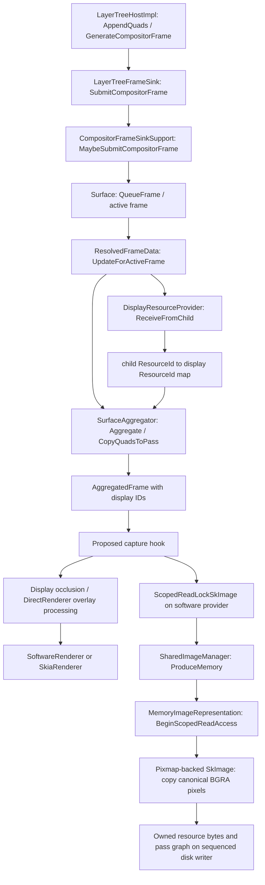

# Chromium frame and resource flow

Status: source reconnaissance and a capture patch whose modified display translation unit **compiled successfully**. No real Viz capture, independent replay or resource-reuse result has passed yet. Chromium 153.0.8010.36 is pinned to `507c6ee3e2f3b2ca0e660547e5b9ea4820c67f4c`.

## Recommended first experiment

Capture immediately after `SurfaceAggregator::Aggregate()` in `Display::DrawAndSwap`, before occlusion culling, overlay processing and the display renderer. Keep Chromium drawing normally for scheduling and reference output. Start with software compositing and copy individual raster resources through `DisplayResourceProviderSoftware::ScopedReadLockSkImage`. This proves the extraction boundary with fewer synchronization changes than a GPU implementation; it does not measure the GPU-backed production path. [Display][display], [software provider][software]

The draft patch is in [`../server/chromium-patches/`](../server/chromium-patches/). It exports diagnostic render-pass JSON plus canonical BGRA resource files, bounded to 180 frames per Display. It compares actual copied bytes before writing another resource payload. It records examined bytes and extraction duration so that zero new payload cannot be mistaken for zero server read cost. Its modified display translation unit compiled successfully; it is not a stable protocol.

## Interception alternatives

| Boundary | What remains for the remote side | Assessment from source |
| --- | --- | --- |
| Renderer-side `CompositorFrame` | Child surface references, pending/active frame selection, fallback/embedding behavior and resource namespaces, as well as final rendering | Earlier does not mean simpler: it moves work now owned by `Surface` and `SurfaceAggregator` into the remote architecture. Chromium already submits this structure over internal IPC, but that does not make it a public stable network contract. |
| Post-`Aggregate` `AggregatedFrame` | Final pass/quad rendering semantics and independent resource payloads | Leading experiment: reuse Chromium's selected surface graph and ID remapping. It still requires a Chromium patch and a renderer-compatible decoder. |
| Final framebuffer export | Pixel/video decoding and presentation | Valid control and the basis of the separate accepted WebRTC approach, but it cannot establish independent texture reuse at the client. |

The first two assessments follow the concrete submission, surface activation and aggregation flow below. [Frame submission][support], [surface lifetime][surface], [surface resolution][aggregator]. The final framebuffer has already lost the pass/quad graph. Be precise about “around OutputSurface”: the Skia output implementation also exposes paint/GPU scheduling interfaces, so its class name alone does not identify one universal pixel-only boundary. Exporting a final composed image is the framebuffer alternative considered here. [Renderer flow][display], [Skia renderer][skia], [GPU output implementation][gpu].

## Exact flow

The standard cc path is `LayerTreeHostImpl::GenerateCompositorFrame` and its frame-sink submission; configurations that run trees in Viz alter where cc executes, so this is not a claim that cc must always run in the renderer process. `CompositorFrameSinkSupport::MaybeSubmitCompositorFrame` validates/submits to `Surface::QueueFrame`. The surface retains pending/active frame state. [cc generation][cc], [frame-sink support][support], [surface][surface]

`ResolvedFrameData::UpdateForActiveFrame` refs the active frame's transferable resources, calls `ReceiveFromChild`, obtains `GetChildToParentMap`, and records each quad's remapped display resource ID. It also assigns aggregate render-pass IDs and validates pass references. `SurfaceAggregator` then resolves child surfaces and copies/remaps those quads into aggregated passes. [Resolved frame][resolved], [resource provider][provider], [aggregator][aggregator]

## Resource resolution and lifetime

| Stage | Identity / contents | Ownership implication |
| --- | --- | --- |
| Renderer submission | Child-local `TransferableResource::id`, SharedImage reference and sync token | Neither ID nor mailbox is a network image |
| Display import | `ReceiveFromChild` allocates display IDs and retains child mapping | Different children may use the same local ID |
| Aggregated quad | Remapped display ResourceId | Resolve with this Display's provider, not an arbitrary renderer resource table |
| Software read | Provider waits for producer sync, creates MemoryImageRepresentation and scoped access, wraps pixmap as SkImage | Copy bytes while scoped lock is alive; never queue a raw pixmap pointer |
| GPU read | Skia provider external-use lock → ImageContext → promise image; GPU sequence acquires backing/access | A promise SkImage on the display sequence is not automatically a CPU-readable image |
| Release | Used-resource declarations and locks determine return to producer, with synchronization/fences | Browser resource return must not wait indefinitely for a remote client |

Sources: [TransferableResource][transferable], [provider implementation][provider], [software implementation][software], [Skia provider][skiaprovider], [Skia image builder][skia], [GPU-side access][gpu].

In the software implementation, `GetSharedImageRepresentation` schedules a dependency on the sync token and waits before `ProduceMemory`. `ScopedReadLockSkImage` uses `BeginScopedReadAccess()->pixmap()` and the provider caches the corresponding image while imported. A missing representation/read lock must make the capture incomplete. This is the cheapest concrete extraction path found in the inspected source, **not** a runtime performance result. [Software provider][software]

In the GPU path, `LockSetForExternalUse::LockResource` establishes an ImageContext and locks/fence state. `SkiaRenderer::ScopedSkImageBuilder` calls `MakePromiseSkImage`; backing access is performed later on the GPU sequence. A GPU extraction extension would need to schedule readback there, retain the resource until the copy completes, obey semaphores/sync tokens and release it through the existing contract. The existing output-surface copy routines demonstrate asynchronous readback infrastructure, but copying an entire output surface would not prove resource remoting. [Skia provider][skiaprovider], [Skia builder][skia], [GPU implementation][gpu]

A more exact GPU follow-up is now identified: `ImageContextImpl::BeginAccessIfNecessaryInternal` resolves the mailbox through `SharedImageRepresentationFactory::ProduceSkia` with DISPLAY_READ usage, then starts scoped read access and obtains the backing textures. `SkiaOutputSurfaceImpl::EnqueueGpuTask`/`FlushGpuTasks` collects producer sync tokens and schedules work on the GPU sequence. The existing `SkiaOutputSurfaceImplOnGpu::CopyOutput` does have a non-framebuffer mailbox path, but it currently obtains **scoped write access** to a SkSurface (with a TODO to use read access). It must not be assumed to be a drop-in read-only extraction method for every transferred texture. Source-usage compatibility, concurrent access, producer synchronization and release callbacks need a deliberate experiment. [ImageContext access](https://github.com/chromium/chromium/blob/507c6ee3e2f3b2ca0e660547e5b9ea4820c67f4c/components/viz/service/display_embedder/image_context_impl.cc), [GPU task scheduling](https://github.com/chromium/chromium/blob/507c6ee3e2f3b2ca0e660547e5b9ea4820c67f4c/components/viz/service/display_embedder/skia_output_surface_impl.cc), [mailbox CopyOutput path][gpu]

Resource IDs are stable only within their import/display lifetime. `ReceiveFromChild` recognizes an already imported child ID; new imports receive new display IDs. None of this is an explicit pixel-generation counter. The first measurement must compare bytes, distinguish stable IDs from identical pixels under new IDs, and measure churn. The capture adapter currently evicts its own cache on absence from a frame; that is deliberately conservative and does not claim Chromium released the resource. [Provider import and return][provider]

## Headless reachability

`OutputSurfaceProviderImpl::CreateOutputSurface` chooses `SoftwareOutputSurface` when GPU compositing is disabled, and `CreateSoftwareOutputDeviceForPlatform` returns a plain software output device for headless mode. `Display::InitializeRenderer` pairs it with `SoftwareRenderer` and `DisplayResourceProviderSoftware`; both renderer choices subsequently share the Aggregate call. That supports trying `headless_shell --disable-gpu --disable-gpu-compositing` with the capture hook. Runtime reachability still needs the patched binary: stock Chrome's headless success from the WebRTC spike does not prove this hook. [Output provider][output], [Display initialization][display]

The shell's `HeadlessWebContentsImpl::InitializeWindow` marks its contents visible, and visibility changes call `WasShown`/`WasHidden`. `HeadlessWindowTreeHost` creates a compositor; external begin-frame control defaults to false in the browser and web-contents options. This supports attempting ordinary scheduled composition without a screenshot request. It is source evidence, not a substitute for observing the hook execute. [Headless window initialization](https://github.com/chromium/chromium/blob/507c6ee3e2f3b2ca0e660547e5b9ea4820c67f4c/headless/lib/browser/headless_web_contents_impl.cc#L422-L435), [headless compositor](https://github.com/chromium/chromium/blob/507c6ee3e2f3b2ca0e660547e5b9ea4820c67f4c/headless/lib/browser/headless_window_tree_host.cc#L20-L23), [default browser options](https://github.com/chromium/chromium/blob/507c6ee3e2f3b2ca0e660547e5b9ea4820c67f4c/headless/public/headless_browser.h#L134).

## Corrected assumptions and remaining gates

See [semantics-research.md](semantics-research.md) for the source-backed semantic audit. In particular:

- The native renderer consumes aggregated pass quads, not compositor pass quads. Filters have moved to the aggregated pass quad.
- Picture/raw-draw paths may rasterize at the final renderer. A raster-resource protocol must reject or materialize them.
- Quad order is front-to-back; ordinary alpha drawing must iterate back-to-front.
- Masking, filters, 3D sorting and texture alpha/color rules remain significant renderer work.
- Embedded active OOPIF surfaces should resolve under the selected root, but native windows/popups do not automatically belong to that root.
- Damage is retained-state metadata. Capture before later mutations and redraw all captured passes initially. A damage-related source comment alone does not establish actual missing quads in this revision.

The GPU-backed resource path, real OOPIF reconstruction, resource reuse under transforms and faithful Metal replay remain unverified. Do not start the live protocol until a recorded actual Chromium frame reconstructs correctly.

## CEF and prebuilt distributions

CEF does not expose this interception boundary through the public rendering APIs inspected. `OnPaint` supplies the completed view/popup BGRA image and dirty rectangles. `OnAcceleratedPaint` supplies a completed frame through a platform GPU handle, including IOSurface on macOS and native-buffer planes on Linux. Those handles have callback-only lifetime and must be copied into application-owned resources; they are not persistent Viz tile identities. [CEF rendering contracts](https://github.com/chromiumembedded/cef/blob/49815fbdaa964d5854c11cad70f5cc247dee2914/include/cef_render_handler.h#L132-L173).

The implementation reinforces that boundary: `CefVideoConsumerOSR` creates a video capturer and forwards `OnFrameCaptured` pixels or platform handles to those paint callbacks. It does not supply the aggregated render-pass graph. [CEF offscreen capture implementation](https://github.com/chromiumembedded/cef/blob/49815fbdaa964d5854c11cad70f5cc247dee2914/libcef/browser/osr/video_consumer_osr.cc#L30-L244).

CEF's binary distributions can avoid source compilation for its existing embedding APIs. Architectural inference: the requested post-aggregation export still requires a Chromium/Viz patch and rebuilt binary, whether hosted directly or through CEF. Adding a CEF callback around that patch would introduce another integration surface. Direct Chromium is therefore the narrower extraction/replay experiment; CEF remains a possible framebuffer control or later embedding convenience. [CEF distribution purpose](https://github.com/chromiumembedded/cef/blob/49815fbdaa964d5854c11cad70f5cc247dee2914/README.md#L20-L41).

This was source/API research, not a CEF runtime test. The inspected CEF commit `49815fbdaa964d5854c11cad70f5cc247dee2914` targets Chromium 154.0.8037.0, distinct from our Chromium 153 capture pin. [Compatibility file](https://github.com/chromiumembedded/cef/blob/49815fbdaa964d5854c11cad70f5cc247dee2914/CHROMIUM_BUILD_COMPATIBILITY.txt).

## Build constraints observed

The Mac had about 175 MiB free at initial inspection, which blocks a local Chromium build and leaves inadequate comfortable space for new native build caches. Bazzite had 109 GiB free, 31 GiB RAM and 8 logical CPUs. Chromium documents at least 100 GB free disk; this narrowly meets the documented minimum but provides little margin. A shallow pinned checkout is being attempted under `/var/home/admin/weave-viz-spike`; subsequent dependency/build work must stop before consuming the 25 GiB reserve for existing workloads. No unrelated files or deployments are cleanup targets. [Build requirements](https://chromium.googlesource.com/chromium/src/+/main/docs/linux/build_instructions.md)

[cc]: https://github.com/chromium/chromium/blob/507c6ee3e2f3b2ca0e660547e5b9ea4820c67f4c/cc/trees/layer_tree_host_impl.cc
[support]: https://github.com/chromium/chromium/blob/507c6ee3e2f3b2ca0e660547e5b9ea4820c67f4c/components/viz/service/frame_sinks/compositor_frame_sink_support.cc
[surface]: https://github.com/chromium/chromium/blob/507c6ee3e2f3b2ca0e660547e5b9ea4820c67f4c/components/viz/service/surfaces/surface.cc
[resolved]: https://github.com/chromium/chromium/blob/507c6ee3e2f3b2ca0e660547e5b9ea4820c67f4c/components/viz/service/display/resolved_frame_data.cc
[provider]: https://github.com/chromium/chromium/blob/507c6ee3e2f3b2ca0e660547e5b9ea4820c67f4c/components/viz/service/display/display_resource_provider.cc
[software]: https://github.com/chromium/chromium/blob/507c6ee3e2f3b2ca0e660547e5b9ea4820c67f4c/components/viz/service/display/display_resource_provider_software.cc
[skiaprovider]: https://github.com/chromium/chromium/blob/507c6ee3e2f3b2ca0e660547e5b9ea4820c67f4c/components/viz/service/display/display_resource_provider_skia.cc
[transferable]: https://github.com/chromium/chromium/blob/507c6ee3e2f3b2ca0e660547e5b9ea4820c67f4c/components/viz/common/resources/transferable_resource.h
[aggregator]: https://github.com/chromium/chromium/blob/507c6ee3e2f3b2ca0e660547e5b9ea4820c67f4c/components/viz/service/display/surface_aggregator.cc
[display]: https://github.com/chromium/chromium/blob/507c6ee3e2f3b2ca0e660547e5b9ea4820c67f4c/components/viz/service/display/display.cc
[skia]: https://github.com/chromium/chromium/blob/507c6ee3e2f3b2ca0e660547e5b9ea4820c67f4c/components/viz/service/display/skia_renderer.cc
[gpu]: https://github.com/chromium/chromium/blob/507c6ee3e2f3b2ca0e660547e5b9ea4820c67f4c/components/viz/service/display_embedder/skia_output_surface_impl_on_gpu.cc
[output]: https://github.com/chromium/chromium/blob/507c6ee3e2f3b2ca0e660547e5b9ea4820c67f4c/components/viz/service/display_embedder/output_surface_provider_impl.cc
