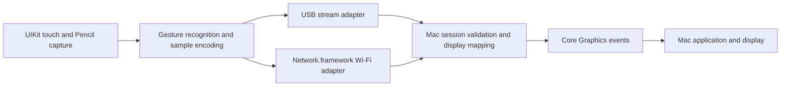

**Mobile trackpad and Apple Pencil tablet — research and proposed delivery plan**

Researched 21 September 2026; project placement confirmed 22 September 2026. Exploratory research for iteration; no app, hardware benchmark, or drawing-app compatibility test was produced. The user selected a self-contained `trackpad/` subdirectory of Weave, tracked by [WVE-81](https://linear.app/jacobfvanzyl/issue/WVE-81/build-native-mobile-trackpad-and-screen-mapped-pencil-tablet). See the [project README](../README.md) for the local boundary and current setup.

The agreed scope is an iPhone/iPad trackpad and a blank iPad drawing surface mapped absolutely to a selected Mac display. In mapped Pencil mode, squeezing Pencil Pro cycles to the next Mac display. USB is preferred; Wi-Fi is required. Pressure and tilt are optional. Initial use is personal, on an iPhone 17e, an iPad Air M3 with Apple Pencil Pro, and a MacBook Air M4 with one external display above the built-in display. Installed OS versions, iPad size, external-display resolution/refresh rate, and which display is designated main remain unspecified.

The recommendation is a universal native Swift mobile app, a native Swift/AppKit Mac companion, and a shared Swift package containing input messages and deterministic input logic. Use public Core Graphics mouse and scroll events initially. Isolate USB transport behind an adapter and prove it early. This keeps the implementation aligned with the requested experience while making the uncertain cable integration independently testable.

Apple documents mouse creation and system event posting through Quartz. Mapping Pencil position/contact into mouse movement/down/drag/up is therefore a credible initial architecture for applications with mouse-operated drawing tools. It does not require pressure-aware tablet recognition. Application compatibility still needs real-device acceptance. [Quartz Event Services](https://developer.apple.com/documentation/coregraphics/quartz-event-services), [mouse event constructor](https://developer.apple.com/documentation/coregraphics/cgevent/init(mouseeventsource:mousetype:mousecursorposition:mousebutton:)), [event posting](https://developer.apple.com/documentation/coregraphics/cgevent/post(tap:)).

The hardware is well suited to this scope. Apple documents Pencil hover on both sizes of iPad Air M3 and USB 3 up to 10 Gbps. iPhone 17e supports USB 2 up to 480 Mbps. These are link capabilities, not latency measurements; tiny input messages do not require the iPad's maximum bandwidth. [iPad Air M3 11-inch specifications](https://support.apple.com/en-gb/122241), [13-inch specifications](https://support.apple.com/en-au/122242), [iPhone 17e specifications](https://www.apple.com/iphone-17e/specs/).

| Layer | Proposed technology | Reason and boundary |
| --- | --- | --- |
| iPhone/iPad app | Swift 6; SwiftUI settings; custom UIKit input view | Direct access to touch lifecycle, Pencil samples, cancellation, hover, and low-latency dispatch |
| Mac companion | Swift/AppKit with optional SwiftUI settings | Menu-bar status, pairing, display selection, permission recovery, event posting |
| Shared logic | Small Swift package | Versioned messages, gesture states, mapping math, replay fixtures, and session rules |
| Wired link | PeerTalk/usbmuxd adapter | Practical source-backed candidate for an ordinary USB cable; OS integration is undocumented |
| Wireless link | Network.framework and Bonjour | Public TCP/QUIC and Apple peer-to-peer Wi-Fi support |
| Mac input | Core Graphics `CGEvent` | Mouse movement, click, drag, and continuous scrolling |
| Diagnostics | Instruments, signposts, event IDs, capture/replay | Separate input, transport, injection, and visible-response delays |

Native Swift is an engineering recommendation, not a claim that another runtime cannot work. This product's critical work is at UIKit and macOS input boundaries; using them directly minimizes bridging and lets us share protocol logic across both apps. PencilKit is useful for a local drawing canvas, but the requested product forwards input to another application; a custom UIKit surface is a better owner of the raw input stream. Metal is unnecessary for a blank surface and can be considered only if a later local visualization needs it.

For deployment targets, choose the installed OS versions after checking the devices. iOS/iPadOS 18 exposes the Pencil low-latency API below. Network.framework's newer Swift concurrency API is available from the 26-generation releases; use it if all target devices support it, otherwise the established `NWConnection`, `NWListener`, and `NWBrowser` family supports the same architecture. API syntax does not establish performance. [UIUpdateLink](https://developer.apple.com/documentation/uikit/uiupdatelink), [Network.framework migration guidance](https://developer.apple.com/documentation/technotes/tn3213-moving-from-multipeer-connectivity-to-network-framework).

The proposed data path is:

Capture input using a `UIView` with `isMultipleTouchEnabled`, `touchesBegan`, `touchesMoved`, `touchesEnded`, and `touchesCancelled`. Distinguish `.direct` finger touches from `.pencil`. Read `coalescedTouches(for:)` immediately in the event callback, preserving sample order and timestamps. Apple's documentation describes hardware-dependent sampling up to 240 Hz; this does not promise a 240 Hz callback cadence or establish either target device's actual timing. Measure sample and callback intervals separately. [Handling touches](https://developer.apple.com/documentation/uikit/handling-touches-in-your-view), [coalesced touches](https://developer.apple.com/documentation/uikit/getting-high-fidelity-input-with-coalesced-touches).

On iOS/iPadOS 18+, experiment with `UIUpdateLink.wantsLowLatencyEventDispatch`. Apple explicitly limits eligibility to Pencil events and gives their handlers a shorter completion window. Keep the callback small, enqueue promptly, and profile before enabling it by default. Do not wait for a display-link tick to send an already available sample. [Low-latency dispatch](https://developer.apple.com/documentation/uikit/uiupdatelink/wantslowlatencyeventdispatch).

Predicted touches must remain temporary: Apple says to discard old predictions when new real samples arrive. Therefore, do not inject predicted coordinates as committed drawing events into arbitrary Mac apps, which cannot generally retract those strokes. Prediction is appropriate only for optional local cursor/stroke previews that we own and can correct. Likewise, later pressure/tilt estimates cannot retroactively edit a stroke already committed to an unrelated app. If these attributes are added, define a deliberate live-estimate policy. [Predicted touches](https://developer.apple.com/documentation/uikit/minimizing-latency-with-predicted-touches), [Pencil estimates](https://developer.apple.com/documentation/uikit/handling-input-from-apple-pencil).

The proposed gesture set is deliberately concrete:

| Gesture | Initial behavior | Implementation detail |
| --- | --- | --- |
| One-finger move | Relative cursor movement | Adjustable sensitivity; deterministic acceleration; reset origin on finger lift |
| One-finger tap | Primary click | Recognize on release within time/movement thresholds |
| Double tap | Double-click | Preserve click count and system timing |
| Double tap and hold, then move | Drag | Press on second contact, drag while held, release on lift |
| Two-finger tap | Secondary click | Require both contacts to remain within tap thresholds |
| Two-finger move | Horizontal and vertical scrolling | Continuous pixel scrolling; natural direction setting |
| Two-finger flick | Momentum scrolling | App-owned velocity/deceleration; interrupt immediately on a new gesture |
| Pencil hover | Absolute cursor positioning | Uses supported hover events without pressing a button |
| Pencil contact/move/lift | Begin/continue/end drawing or dragging | Absolute primary-button sequence |
| Pencil Pro squeeze in mapped mode | Cycle to the next Mac display | One completed squeeze per switch; wrap around; show the selected display |

Quartz documents click count, continuous scrolling, and scroll/momentum phase fields. Recognition, thresholds, acceleration, and inertia remain our responsibility. Use a single tested state machine to arbitrate one-finger motion, two-finger taps, scrolling, and dragging. Reset centroid baselines when contact count changes to prevent cursor jumps. Do not hold every pointer move behind a double-tap timeout; apply recognition delays only to ambiguous discrete actions. [CGEvent fields](https://developer.apple.com/documentation/coregraphics/cgeventfield), [scroll constructor](https://developer.apple.com/documentation/coregraphics/cgevent/init(scrollwheelevent2source:units:wheelcount:wheel1:wheel2:wheel3:)).

Recognizing pinch or a three-finger swipe on iPad is different from delivering a native macOS trackpad gesture. The reviewed public mouse/scroll route does not establish full Magic Trackpad identity, native pinch/rotation, reversible Spaces swipes, Force Touch, or exact Apple acceleration. Keep these as separately evaluated extensions, potentially using user-configured shortcuts. Basic gestures listed above are the initial acceptance contract. [Quartz event types](https://developer.apple.com/documentation/coregraphics/cgeventtype).

For Pencil mode, default to Pencil-only drawing and suppress finger control over the main surface while Pencil is active. This avoids a resting palm generating clicks or scrolling. A deliberate two-finger navigation mode and double-tap shortcuts can follow. UIKit provides hover and Pencil interactions, including hardware-specific pose and roll information. [Pencil interactions](https://developer.apple.com/documentation/uikit/uipencilinteraction), [hover recognizer](https://developer.apple.com/documentation/uikit/uihovergesturerecognizer), [Pencil Pro interactions](https://developer.apple.com/videos/play/wwdc2024/10214/).

The requested squeeze action belongs in the initial mapped mode. Register `UIPencilInteractionDelegate.pencilInteraction(_:didReceiveSqueeze:)` and switch on `.ended` once, ignoring cancelled gestures. Apple explicitly supports app-specific squeeze actions. Configure this as the app's custom action and handle system-disabled squeeze settings in setup. [Handling squeezes](https://developer.apple.com/documentation/applepencil/handling-squeezes-from-apple-pencil).

Proposed display-cycle behavior: use a stable list of active logical displays, defaulting to their left-to-right arrangement with vertical position as a tie-breaker; skip duplicate mirrored outputs and wrap from last to first. Briefly show the selected display's name and index on the iPad. With only one display, keep it selected. If squeezed during a stroke, release the old stroke, switch mapping, and require Pencil lift before another down. The Mac owns display enumeration and acknowledges the new mapping generation; discard old-generation samples. This prevents queued motion from drawing onto the newly selected display. Display ordering is a proposed default that can be adjusted during hands-on review.

The initial acceptance setup is the user's MacBook Air M4 with an external display above its built-in display. With both displays active and extended, each squeeze toggles between them. Map the complete active tablet area to the selected display; trackpad mode remains free to move across the extended desktop. If the built-in display is designated main, the upper external display can have a negative global Y origin; use the actual bounds rather than assuming either display starts at zero. Recompute the aspect-preserving tablet region for each display. Test external-display removal and lid closure: if only one logical display remains active, keep it selected and make squeeze a no-op. Preserve the rule that mapping changes release an active stroke and require lift before drawing resumes.

Display mapping should use one selected display, with an aspect-preserving active rectangle on the iPad. This prevents circles becoming ellipses when the two screens have different shapes. For normalized input `(u, v)`, compute `x = displayOriginX + u * displayWidth` and `y = displayOriginY + v * displayHeight`, then clamp to valid display coordinates. Use the Core Graphics global coordinate system throughout, including negative origins for displays left of or above the main display. Do not accidentally mix AppKit's flipped coordinates or Retina backing pixels with cursor coordinates. Observe display reconfiguration and cancel an active stroke before switching display, rotating the tablet, or resizing its active region. [Display bounds](https://developer.apple.com/documentation/coregraphics/cgdisplaybounds(_:)), [display services](https://developer.apple.com/documentation/coregraphics/quartz-display-services).

USB is the first feasibility gate. PeerTalk's Mac source opens a Unix-domain stream socket at `/private/var/run/usbmuxd` and requests a connection to a port on the mobile device. The mobile side uses a socket listener. This is an application-data tunnel through Apple's device connection infrastructure; it does not turn the iPad into a physical USB HID tablet. The repository demonstrates the implementation, but current Apple documentation reviewed here does not establish the daemon protocol as a supported general app API. [PeerTalk](https://github.com/rsms/peertalk), [USB adapter source](https://github.com/rsms/peertalk/blob/master/peertalk/PTUSBHub.m).

For personal use this is a reasonable experiment. Use the system daemon, isolate the adapter, and pin any dependency; do not replace system components. Prove control with both radios' data paths excluded, the debugger detached, and the app launched normally. Record trust, unlock, cable removal, sleep/wake, and reconnection behavior. A development installation may need Developer Mode; distinguish that from what the transport itself requires. Apple documents device/computer trust and data-capable cable requirements. [Computer trust](https://support.apple.com/en-me/109054), [connection troubleshooting](https://support.apple.com/en-nz/108643).

ExternalAccessory is designed for supported accessories and is not a documented general Mac-to-iPhone cable pipe. iPad DriverKit also does not make arbitrary USB device access available to all apps. Ethernet adapters can provide a supported wired IP comparison if the ordinary cable experiment fails, but add hardware and do not satisfy the original single-cable experience. USB Personal Hotspot must not be assumed to work as a universal solution for a Wi-Fi-only iPad. [ExternalAccessory](https://developer.apple.com/documentation/externalaccessory), [Apple DTS on DriverKit restrictions](https://developer.apple.com/forums/thread/747029), [Apple DTS on wired IP](https://developer.apple.com/forums/thread/821159).

For wireless discovery and transport, use Network.framework plus Bonjour. Enable Apple peer-to-peer Wi-Fi with `includePeerToPeer` and test same-LAN and router-free operation separately; opting in does not guarantee which route wins or lower latency. Apple now advises against new Multipeer Connectivity code: its 2026 guidance says the framework is deprecated. Wi-Fi Aware is a different technology; its reviewed framework availability and hardware list do not establish a native Mac path, so it is not required here. [Apple networking guidance](https://developer.apple.com/documentation/technotes/tn3151-choosing-the-right-networking-api), [Multipeer Connectivity status](https://developer.apple.com/documentation/multipeerconnectivity), [Wi-Fi Aware](https://developer.apple.com/documentation/wifiaware).

Start the measurement harness with a small framed reliable stream so event ordering is easy to establish. For a TCP comparison, enable `noDelay` to disable Nagle's algorithm; that does not remove retransmission stalls or all buffering. Compare against QUIC's reliable streams plus best-effort datagrams on wireless. QUIC gives a standardized encrypted transport and independent delivery choices; it is not automatically faster for this workload. [TCP options](https://developer.apple.com/documentation/network/nwprotocoltcp/options), [QUIC options](https://developer.apple.com/documentation/network/nwprotocolquic/options).

The proposed delivery rules are:

- Reliable ordered messages for pairing, capabilities, configuration, button transitions, stroke boundaries, and cancellation.
- Timestamped binary samples for the input stream, with protocol version, session epoch, sequence number, gesture/stroke generation, coordinates, and explicit contact state. Optional Pencil attributes can be negotiated later.
- Latest-position replacement is suitable for stale hover updates. Drawing paths need ordered samples or bounded redundancy; arbitrarily dropping intermediate samples can cut corners.
- Relative cursor and scroll movement cannot safely use naive latest-packet-wins delivery. Use cumulative displacement with deduplication or preserve/accumulate deltas so lost packets do not permanently lose distance.
- If reliable transitions and motion datagrams coexist, enforce cross-channel generation rules. An old motion packet must not arrive after pen-up and restart a stroke; motion must not apply before its corresponding down event.
- Keep queues bounded. Preserve down/up ordering, and reset a badly stalled session rather than replaying seconds of stale input.
- Prefer USB only after its session is verified. Handover occurs between gestures when possible; a forced handover releases state and starts a new epoch. Never replay a held button into a new connection.

These are engineering design proposals. Benchmark both the simpler reliable stream and the more complex datagram path; choose based on measured latency tails and drawing correctness rather than protocol fashion.

The Mac app needs Accessibility authorization for posting events. Implement permission readiness with `CGPreflightPostEventAccess` and `CGRequestPostEventAccess`. Plain output posting does not justify requesting Input Monitoring; add that only if a later feature needs to observe other input. A blank tablet has no screen-capture component and therefore no reason to request Screen Recording. [Apple engineering explanation](https://developer.apple.com/forums/thread/103992), [preflight](https://developer.apple.com/documentation/coregraphics/cgpreflightposteventaccess()), [request](https://developer.apple.com/documentation/coregraphics/cgrequestposteventaccess()).

Declare local-network purpose and the specific Bonjour service types. Test permission denial/recovery on actual mobile devices and on the Mac; simulator or terminal-launched behavior is not sufficient evidence. Authenticate paired devices, keep identities in Keychain, show the active controller on the Mac, and provide an immediate stop action. Use authenticated session establishment over USB too; computer trust is broader than permission to control this app. [Local network privacy](https://developer.apple.com/documentation/technotes/tn3179-understanding-local-network-privacy).

For personal installation, use Xcode signing for the mobile app and a local native companion. Preserve a stable bundle/signing identity so permission testing remains meaningful. If sharing publicly later, a signed/notarized direct-download Mac app is the route to investigate first; neither USB daemon access nor broad event injection should be assumed Mac App Store compatible. App Store sandbox and public-API constraints need a separate distribution assessment. [App Sandbox](https://developer.apple.com/documentation/security/protecting-user-data-with-app-sandbox), [App Review Guidelines](https://developer.apple.com/app-store/review/guidelines/).

Keep the mobile app visible during use. Provide a dim, minimal surface and prevent idle sleep only during an active session. On backgrounding, screen lock, cancellation, permission loss, cable removal, mode change, or timeout, the Mac must release all buttons held by this session. Coordinate physical mouse and remote input so the companion does not retain a stale cursor origin. Screen-edge gestures remain owned by iOS; immersive apps can request deferral, which is not permanent suppression. [Screen-edge gesture deferral](https://developer.apple.com/documentation/uikit/uiviewcontroller/preferredscreenedgesdeferringsystemgestures).

Latency must be measured from physical input to visible Mac response. Log sample time, callback time, send time, receive time, post time, and event identifiers; report p50, p95, p99, worst stalls, queue depth, and missed/duplicated events. Clock epochs on two devices are unrelated: estimate offset and uncertainty, and do not label RTT/2 as measured one-way latency. Use high-speed camera recordings of physical interaction and Mac response to verify the overall result. Display intervals are about 16.7 ms at 60 Hz and 8.3 ms at 120 Hz, so Mac display refresh must be recorded in each run. These intervals are arithmetic, not expected app latency.

Proposed initial engineering goals, subject to the first measurements: keep our capture/encoding and receive/injection processing each below 1 ms at p95 in release builds; maintain a bounded queue without accumulating stale motion; achieve zero stuck-button failures in scripted interruption tests. Do not set a promised end-to-end millisecond figure before measuring the specified hardware. Compare against direct Mac input for cursor response and a local iPad capture diagnostic for sampling behavior. The latency target should include consistency under load, not just the best idle result. Apple recommends profiling continuous interaction against frame deadlines and keeping unrelated work off the main thread. [Responsiveness guidance](https://developer.apple.com/documentation/xcode/improving-app-responsiveness).

Use this proposed sequence for iteration:

1. **Prove the complete input path and USB.** Minimal UIKit capture, Mac posting, USB tunnel and a simple wireless comparator. Demonstrate finger motion/click and a Pencil stroke with Wi-Fi excluded from the wired test. Record permission/trust behavior and baseline timing. If ordinary USB fails, report that result before expanding UI work.
2. **Deliver the usable trackpad.** One/two-finger arbitration, primary/secondary/double clicks, tap-drag, two-axis scrolling, natural direction, and momentum. Add trace replay tests for accidental clicks, contact-count changes, and cancellation. Test Finder, text selection, native scroll views, and browser scrolling.
3. **Deliver the Pencil tablet.** Selected-display mapping, aspect-preserving active region, hover, contact/down-drag-up, squeeze-to-next-display, palm isolation, and orientation/display-change cancellation. Verify corner targets, circles, tiny strokes, and long strokes in a native test canvas, a browser canvas, and a mouse-compatible drawing app. Test squeeze while hovering, mid-stroke, on the last display, and after a display disconnect. Pressure is not a completion criterion.
4. **Finish wireless and lifecycle.** Pairing, remembered devices, LAN and peer-to-peer testing, USB preference, safe reconnection, status UI, and permission recovery. Compare TCP against QUIC under interference before committing to the more complex path.
5. **Tune on the actual devices.** Release builds on iPhone 17e, iPad Air M3/Pencil Pro, and MacBook Air M4 with its external display above the built-in display. Record and measure each Mac display's refresh rate separately. Run sustained idle/busy Wi-Fi, USB direct/hub, thermal, Low Power Mode, and Mac-load tests. Tune acceleration and scrolling by feel after trace correctness is established. Publish the measured latency distributions and unresolved defects.

Each stage ends with something to try, plus a clear measurement or correctness gate. These are planning stages rather than calendar estimates; the USB result and the desired gesture polish determine effort. The project home and issue association are established as Weave's `trackpad/` directory and WVE-81.

Pressure and tilt can be a later experiment. Quartz exposes tablet and proximity fields; setting pressure on a mouse event does not prove tablet support in arbitrary drawing apps. CoreHID's public `HIDVirtualDevice` is another candidate if richer device semantics become useful, with entitlement/provisioning and application compatibility to prove. A DriverKit extension adds further packaging and approval work and is unnecessary for the agreed baseline. [Quartz tablet fields](https://developer.apple.com/documentation/coregraphics/cgeventfield), [CoreHID virtual devices](https://developer.apple.com/documentation/corehid/creatingvirtualdevices), [virtual-device entitlement](https://developer.apple.com/documentation/bundleresources/entitlements/com.apple.developer.hid.virtual.device), [DriverKit entitlements](https://developer.apple.com/documentation/driverkit/requesting-entitlements-for-driverkit-development).

Astropad Slate is a particularly close comparison: its first-party documentation describes a blank iPad mapped to a Mac display, touch gestures, Pencil hover, and USB/Wi-Fi/peer-to-peer links. Use it as an optional interaction benchmark, not proof of its internal APIs or our eventual latency. Sidecar and Astropad Studio belong to the screen-mirroring variant; that pipeline is outside the agreed scope. [Slate](https://astropad.com/product/slate/), [Slate versus Studio](https://support.astropad.com/en/articles/11836034-astropad-slate-vs-astropad-studio), [Sidecar](https://support.apple.com/en-ie/102597).

The hardware, physical display arrangement, project home, and issue association are established. At device setup, verify installed OS versions and logical display bounds/refresh rates. The core recommendation remains native capture, public mouse/scroll injection, a blank absolute tablet, an early USB proof, and measured wireless behavior.
